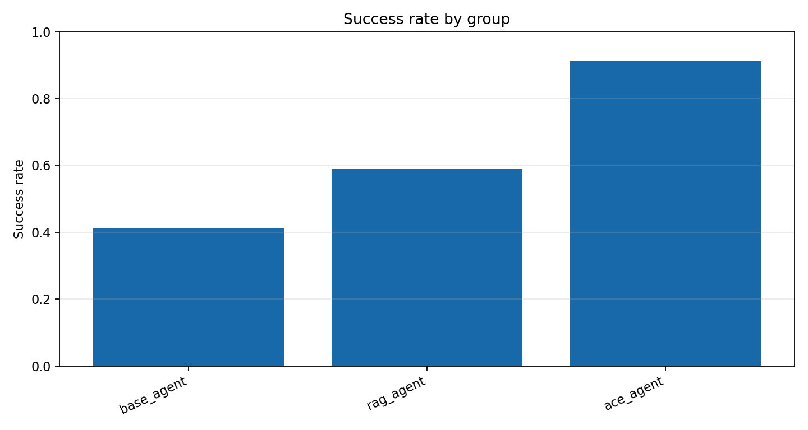

# 总体任务成功率对比 实验报告

Run ID：exp1_20260512_194339

生成时间：2026-05-12T21:40:26

配置：`{"use_critic": true, "use_evolution": true, "use_experience_retrieval": true, "use_code_agent": true, "use_context_manager": true, "use_real_ace": false, "mock_mode": true}`

## 实验设计思路

实验一采用“习题册 + 参考答案”评测设计，比较 Base Agent、RAG Agent 与 ACE Agent。三组尽量复用主系统工具/代码/Agent 链路，区别在于是否启用历史对话记忆、经验库检索和经验写入；成功率由返回结构与参考答案的匹配分数决定。

任务展开规模：34 个任务单元；本次 trace 数：102；成功 65，失败 37。

任务文件：`data/experiments/exp1_workbook.json`。

## 数据集说明

实验使用 `data/geodata/` 下的成都 POI 与行政区 GeoJSON 图层，任务集通过自然语言描述调用检索、查询、邻近、缓冲、叠加、空间连接、聚类、热点、统计和导出等 GIS 能力。

| 数据层 | 要素数 | 几何类型 | 字段示例 |
| --- | --- | --- | --- |
| 交通设施 | 20226 | Point | name, type, address, lng, lat, province |
| 住宿服务 | 6473 | Point | name, type, address, lng, lat, province |
| 体育 | 6753 | Point | name, type, address, lng, lat, province |
| 公司 | 42299 | Point | name, type, address, lng, lat, province |
| 医疗 | 12974 | Point | name, type, address, lng, lat, province |
| 商务住宅 | 11726 | Point | name, type, address, lng, lat, province |
| 成都行政区 | 24 | Polygon | NAME |
| 政府 | 6959 | Point | name, type, address, lng, lat, province |
| 生活服务 | 54729 | Point | name, type, address, lng, lat, province |
| 科教文化 | 10916 | Point | name, type, address, lng, lat, province |
| 购物 | 102214 | Point | name, type, address, lng, lat, province |
| 金融服务 | 7157 | Point | name, type, address, lng, lat, province |
| 风景 | 337 | Point | name, type, address, lng, lat, province |
| 餐饮 | 61101 | Point | name, type, address, lng, lat, province |

## 任务集说明

实验一任务集拆成 `exp1_workbook.json` 习题册和 `exp1_reference_answers.json` 参考答案。习题册给出自然语言任务、难度、能力标签和会话链；参考答案给出期望工具、输出类型、实体/关键词、是否需要历史记忆、经验检索、经验写入或代码执行。成功率由结构化返回与参考答案的匹配分数计算。

| 类别 | 任务数 |
| --- | --- |
| ace_multi_step | 3 |
| adversarial_validation | 3 |
| attribute_query | 2 |
| buffer_analysis | 1 |
| code_exact_check | 2 |
| code_required | 2 |
| experience_evolution | 3 |
| experience_retrieval | 5 |
| hotspot | 1 |
| memory_followup | 5 |
| memory_seed | 3 |
| nearby_analysis | 1 |
| overlay_analysis | 1 |
| poi_search | 1 |
| spatial_join | 1 |

## Trace 说明

每个 trace 是一次任务在某个框架或消融组下的完整记录。报告中的指标均可由 trace 字段直接复算。

| 字段 | 含义 |
| --- | --- |
| task_id | 展开后的任务编号；包含模板编号、重复轮次或 batch 信息。 |
| agent_type | 执行该 trace 的框架、消融组或经验库策略。 |
| query | 自然语言 GIS 任务文本。 |
| category | 任务类别，例如 POI 检索、邻近分析、叠加分析、热点分析等。 |
| expected_tools | 任务设计时标注的期望工具链，用于计算工具选择准确率。 |
| selected_tools | 系统实际选择或模拟选择的工具链。 |
| execution_trace | 意图识别、工具选择、执行评估等关键步骤记录。 |
| errors / error_signature | 运行中出现的错误及其归一化签名，用于重复错误统计。 |
| critic_diagnosis | CriticAgent 产生的结构化诊断，消融时可为空或弱化。 |
| retrieved_experiences | 本次任务检索到的经验条目，用于经验复用率和经验有效性分析。 |
| generated_experience | 任务后沉淀的新经验，用于观察 Evolution 是否产生可复用知识。 |
| metrics | 单条 trace 的可计算指标，如 turns、runtime、execution_success、result_correctness、repair_success。 |
| structured_response | 实验一的新结构化返回，包含 selected_tools、output_types、entities、keywords、memory/experience/code 证据。 |
| validation | 实验一按参考答案自动评分的结果，包含总分、阈值、缺失项和分项得分。 |

## 指标计算方法

| 指标 | 字段 | 计算方式 |
| --- | --- | --- |
| 任务成功率 | success_rate / task_success_rate | 成功 trace 数 / trace 总数。success=true 记为 1，否则为 0。 |
| 工具选择准确率 | tool_selection_accuracy | 对每条 trace 计算 \|expected_tools ∩ selected_tools\| / \|expected_tools\|，再对有效 trace 求平均。 |
| 执行成功率 | execution_success_rate | 无 errors 且 metrics.execution_success=true 的 trace 数 / trace 总数。 |
| 结果正确率 | result_correctness | metrics.result_correctness 的算术平均值，取值范围 0-1。 |
| 平均轮数 | average_turns | metrics.turns 的算术平均值，用于衡量交互/推理链路长度。 |
| 平均耗时 | average_runtime / average_latency | metrics.runtime 的算术平均值，单位为秒。 |
| 用户干预次数 | user_intervention_count | 所有 trace 的 metrics.user_intervention_count 求和。 |
| 错误数 | error_count | 所有 trace 的 errors 列表长度求和。 |
| 重复错误率 | repeated_error_rate | 出现重复 error_signature 的错误 trace 数 / trace 总数。 |
| 修复成功率 | repair_success_rate / self_repair_rate | repair_attempted=true 的 trace 中 repair_success=true 的比例。 |
| 经验复用率 | experience_reuse_rate | retrieved_experiences 非空的 trace 数 / trace 总数。 |
| 知识保留率 | knowledge_retention_rate | Exp4 最终快照中仍保留的早期经验数 / 早期经验总数。 |
| 冗余率 | redundancy_rate | 经验文本指纹两两 Jaccard 相似度 >= 0.72 的组合数 / 组合总数。 |
| 上下文 token 数 | context_token_count | 中文字符、英文 token 和标点的近似加权计数，用于观察上下文膨胀。 |
| Collapse 事件数 | collapse_event_count | 相邻快照中知识保留率下降 >=0.25、准确率下降 >=0.2 或冗余率上升 >=0.25 的次数。 |

## 结果指标

| 组别 | average_runtime | average_turns | code_execution_success_rate | error_count | execution_success_rate | experience_add_rate | experience_retrieval_rate | memory_success_rate | result_correctness | task_success_rate | tool_selection_accuracy | user_intervention_count |
| --- | --- | --- | --- | --- | --- | --- | --- | --- | --- | --- | --- | --- |
| base_agent | 0.106 | 2.735 | 1.000 | 20 | 0.412 | 0.000 | 0.000 | 0.000 | 0.732 | 0.412 | 0.833 | 0 |
| rag_agent | 0.112 | 3.335 | 1.000 | 14 | 0.588 | 0.000 | 1.000 | 0.000 | 0.843 | 0.588 | 0.814 | 0 |
| ace_agent | 0.115 | 3.735 | 1.000 | 3 | 0.912 | 1.000 | 1.000 | 1.000 | 0.969 | 0.912 | 0.971 | 0 |

## 可视化图表

图表由当前 result.json 直接生成，便于论文或答辩材料引用。

## 总结分析

实验一中 ACE-WebGIS 的任务成功率为 0，最高组为 ace_agent；可重点讨论工具链、代码执行和经验闭环带来的差异。

基于实验结果，主要发现如下：**ACE智能体在总体任务成功率上显著领先**，达到91.18%，远高于基础智能体的41.18%和RAG智能体的58.82%。同时，ACE智能体的工具选择准确率（97.06%）和结果正确性（96.94%）均为最高，错误次数最少（仅3次），而基础智能体错误最多（20次）。

**可能原因**：ACE智能体具备完整的记忆与经验机制（记忆成功率为1.0，经验检索与添加率均为1.0），使其能有效复用历史经验，提升决策质量。RAG智能体虽能检索经验（检索率1.0），但缺乏记忆写入能力（添加率为0），导致经验无法持续积累，性能提升有限。基础智能体完全无记忆与经验支持，表现最弱。

**论文中可强调的结论**：引入经验记忆机制是提升GIS智能体任务成功率的关键；ACE框架通过“经验检索-执行-记忆”闭环，显著增强了智能体的工具选择准确性与结果正确性，为复杂地理空间任务自动化提供了有效方案。
