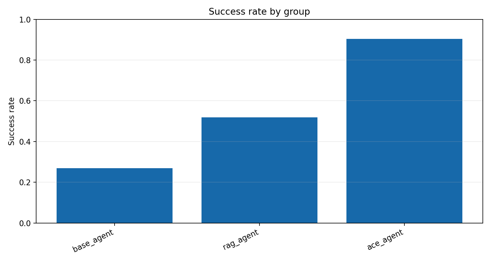

# 总体任务成功率对比 实验报告

Run ID：exp1_20260512_215847

生成时间：2026-05-12T21:58:50

配置：`{"use_critic": true, "use_evolution": true, "use_experience_retrieval": true, "use_code_agent": true, "use_context_manager": true, "use_real_ace": false, "mock_mode": true}`

## 实验设计思路

实验一采用“习题册 + 参考答案”评测设计，比较 Base Agent、RAG Agent 与 ACE Agent。三组尽量复用主系统工具/代码/Agent 链路，区别在于是否启用历史对话记忆、经验库检索和经验写入；成功率由返回结构与参考答案的匹配分数决定。

任务展开规模：52 个任务单元；本次 trace 数：156；成功 88，失败 68。

任务文件：`data/experiments/exp1_workbook.json`。

## 数据集说明

实验使用 `data/geodata/` 下的成都 POI 与行政区 GeoJSON 图层，任务集通过自然语言描述调用检索、查询、邻近、缓冲、叠加、空间连接、聚类、热点、统计和导出等 GIS 能力。

| 数据层 | 要素数 | 几何类型 | 字段示例 |
| --- | --- | --- | --- |
| 交通设施 | 20226 | Point | name, type, address, lng, lat, province |
| 住宿服务 | 6473 | Point | name, type, address, lng, lat, province |
| 体育 | 6753 | Point | name, type, address, lng, lat, province |
| 公司 | 42299 | Point | name, type, address, lng, lat, province |
| 医疗 | 12974 | Point | name, type, address, lng, lat, province |
| 商务住宅 | 11726 | Point | name, type, address, lng, lat, province |
| 成都行政区 | 24 | Polygon | NAME |
| 政府 | 6959 | Point | name, type, address, lng, lat, province |
| 生活服务 | 54729 | Point | name, type, address, lng, lat, province |
| 科教文化 | 10916 | Point | name, type, address, lng, lat, province |
| 购物 | 102214 | Point | name, type, address, lng, lat, province |
| 金融服务 | 7157 | Point | name, type, address, lng, lat, province |
| 风景 | 337 | Point | name, type, address, lng, lat, province |
| 餐饮 | 61101 | Point | name, type, address, lng, lat, province |

## 任务集说明

实验一任务集拆成 `exp1_workbook.json` 习题册和 `exp1_reference_answers.json` 参考答案。习题册给出自然语言任务、难度、能力标签和会话链；参考答案给出期望工具、输出类型、实体/关键词、是否需要历史记忆、经验检索、经验写入或代码执行。成功率由结构化返回与参考答案的匹配分数计算。

| 类别 | 任务数 |
| --- | --- |
| ace_multi_step | 7 |
| adversarial_validation | 3 |
| attribute_query | 2 |
| buffer_analysis | 1 |
| code_exact_check | 2 |
| code_required | 2 |
| experience_evolution | 5 |
| experience_retrieval | 14 |
| hotspot | 1 |
| memory_followup | 7 |
| memory_seed | 4 |
| nearby_analysis | 1 |
| overlay_analysis | 1 |
| poi_search | 1 |
| spatial_join | 1 |

## Trace 说明

每个 trace 是一次任务在某个框架或消融组下的完整记录。报告中的指标均可由 trace 字段直接复算。

| 字段 | 含义 |
| --- | --- |
| task_id | 展开后的任务编号；包含模板编号、重复轮次或 batch 信息。 |
| agent_type | 执行该 trace 的框架、消融组或经验库策略。 |
| query | 自然语言 GIS 任务文本。 |
| category | 任务类别，例如 POI 检索、邻近分析、叠加分析、热点分析等。 |
| expected_tools | 任务设计时标注的期望工具链，用于计算工具选择准确率。 |
| selected_tools | 系统实际选择或模拟选择的工具链。 |
| execution_trace | 意图识别、工具选择、执行评估等关键步骤记录。 |
| errors / error_signature | 运行中出现的错误及其归一化签名，用于重复错误统计。 |
| critic_diagnosis | CriticAgent 产生的结构化诊断，消融时可为空或弱化。 |
| retrieved_experiences | 本次任务检索到的经验条目，用于经验复用率和经验有效性分析。 |
| generated_experience | 任务后沉淀的新经验，用于观察 Evolution 是否产生可复用知识。 |
| metrics | 单条 trace 的可计算指标，如 turns、runtime、execution_success、result_correctness、repair_success。 |
| structured_response | 实验一的新结构化返回，包含 selected_tools、output_types、entities、keywords、memory/experience/code 证据。 |
| validation | 实验一按参考答案自动评分的结果，包含总分、阈值、缺失项和分项得分。 |

## 指标计算方法

| 指标 | 字段 | 计算方式 |
| --- | --- | --- |
| 任务成功率 | success_rate / task_success_rate | 成功 trace 数 / trace 总数。success=true 记为 1，否则为 0。 |
| 工具选择准确率 | tool_selection_accuracy | 对每条 trace 计算 \|expected_tools ∩ selected_tools\| / \|expected_tools\|，再对有效 trace 求平均。 |
| 执行成功率 | execution_success_rate | 无 errors 且 metrics.execution_success=true 的 trace 数 / trace 总数。 |
| 结果正确率 | result_correctness | metrics.result_correctness 的算术平均值，取值范围 0-1。 |
| 平均轮数 | average_turns | metrics.turns 的算术平均值，用于衡量交互/推理链路长度。 |
| 平均耗时 | average_runtime / average_latency | metrics.runtime 的算术平均值，单位为秒。 |
| 用户干预次数 | user_intervention_count | 所有 trace 的 metrics.user_intervention_count 求和。 |
| 错误数 | error_count | 所有 trace 的 errors 列表长度求和。 |
| 重复错误率 | repeated_error_rate | 出现重复 error_signature 的错误 trace 数 / trace 总数。 |
| 修复成功率 | repair_success_rate / self_repair_rate | repair_attempted=true 的 trace 中 repair_success=true 的比例。 |
| 经验复用率 | experience_reuse_rate | retrieved_experiences 非空的 trace 数 / trace 总数。 |
| 知识保留率 | knowledge_retention_rate | Exp4 最终快照中仍保留的早期经验数 / 早期经验总数。 |
| 冗余率 | redundancy_rate | 经验文本指纹两两 Jaccard 相似度 >= 0.72 的组合数 / 组合总数。 |
| 上下文 token 数 | context_token_count | 中文字符、英文 token 和标点的近似加权计数，用于观察上下文膨胀。 |
| Collapse 事件数 | collapse_event_count | 相邻快照中知识保留率下降 >=0.25、准确率下降 >=0.2 或冗余率上升 >=0.25 的次数。 |

## 结果指标

| 组别 | average_runtime | average_turns | code_execution_success_rate | error_count | execution_success_rate | experience_add_rate | experience_retrieval_rate | memory_success_rate | result_correctness | task_success_rate | tool_selection_accuracy | user_intervention_count |
| --- | --- | --- | --- | --- | --- | --- | --- | --- | --- | --- | --- | --- |
| base_agent | 0.106 | 2.808 | 1.000 | 38 | 0.269 | 0.000 | 0.000 | 0.000 | 0.642 | 0.269 | 0.824 | 0 |
| rag_agent | 0.112 | 3.408 | 1.000 | 25 | 0.519 | 0.000 | 1.000 | 0.000 | 0.813 | 0.519 | 0.830 | 0 |
| ace_agent | 0.116 | 3.808 | 1.000 | 5 | 0.904 | 1.000 | 1.000 | 1.000 | 0.954 | 0.904 | 0.981 | 0 |

## 实验一任务明细：返回结果与参考答案

本表逐题列出用户任务、参考答案要点以及 Base / RAG / ACE 三类 Agent 的返回摘要与评分结果。其中参考答案来自 data/experiments/exp1_reference_answers.json，返回结果来自本次 run 的 trace。

| 任务 | 类别 | 任务描述 | 参考答案要点 | Base 返回结果 | RAG 返回结果 | ACE 返回结果 |
| --- | --- | --- | --- | --- | --- | --- |
| exp1_q01_search | poi_search | 搜索名称包含“医院”的 POI，并在地图上高亮所有匹配结果，同时返回结果表。 | 工具: search_poi 输出: map_layer, table 实体: 医院, 医疗, POI 关键词: 搜索, 高亮, 结果表 | 通过 / score=1.0 工具: search_poi 输出: map_layer, table 回答: 搜索名称包含“医院”的 POI，并在地图上高亮所有匹配结果，同时返回结果表。 已按主系统工具链执行。 医院 医疗 POI 搜索 高亮 结果表 | 通过 / score=1.0 工具: search_poi 输出: map_layer, table 回答: 搜索名称包含“医院”的 POI，并在地图上高亮所有匹配结果，同时返回结果表。 已按主系统工具链执行。 医院 医疗 POI 搜索 高亮 结果表 | 通过 / score=1.0 工具: search_poi 输出: map_layer, table 回答: 搜索名称包含“医院”的 POI，并在地图上高亮所有匹配结果，同时返回结果表。 已按主系统工具链执行。 医院 医疗 POI 搜索 高亮 结果表 |
| exp1_q02_attribute_query | attribute_query | 查询餐饮图层中 type 字段包含“火锅”的点位，返回结果表并在地图上高亮。 | 工具: query_poi_by_conditions 输出: map_layer, table 实体: 餐饮, 火锅, type 关键词: 查询, 字段, 高亮 | 通过 / score=1.0 工具: query_poi_by_conditions 输出: map_layer, table 回答: 查询餐饮图层中 type 字段包含“火锅”的点位，返回结果表并在地图上高亮。 已按主系统工具链执行。 餐饮 火锅 type 查询 字段 高亮 | 通过 / score=1.0 工具: query_poi_by_conditions 输出: map_layer, table 回答: 查询餐饮图层中 type 字段包含“火锅”的点位，返回结果表并在地图上高亮。 已按主系统工具链执行。 餐饮 火锅 type 查询 字段 高亮 | 通过 / score=1.0 工具: query_poi_by_conditions 输出: map_layer, table 回答: 查询餐饮图层中 type 字段包含“火锅”的点位，返回结果表并在地图上高亮。 已按主系统工具链执行。 餐饮 火锅 type 查询 字段 高亮 |
| exp1_q03_nearby_crs | nearby_analysis | 找出科教文化图层中“学校”500 米范围内的餐饮点，执行前说明需要统一到米制投影。 | 工具: find_nearby 输出: map_layer, table 实体: 科教文化, 学校, 餐饮, 500, 米 关键词: 邻近, 距离, CRS, 投影 | 通过 / score=1.0 工具: find_nearby 输出: map_layer, table 回答: 找出科教文化图层中“学校”500 米范围内的餐饮点，执行前说明需要统一到米制投影。 已按主系统工具链执行。 科教文化 学校 餐饮 500 米 邻近 距离 CRS 投影 | 通过 / score=1.0 工具: find_nearby 输出: map_layer, table 检索经验: gis-crs-001 回答: 找出科教文化图层中“学校”500 米范围内的餐饮点，执行前说明需要统一到米制投影。 已按主系统工具链执行。 根据经验，距离分析前需要检查 CRS 并统一到米制投影。 科教文化 学校 餐饮 500 米 邻近 距离 CRS 投影 | 通过 / score=1.0 工具: find_nearby 输出: map_layer, table 检索经验: gis-crs-001 回答: 找出科教文化图层中“学校”500 米范围内的餐饮点，执行前说明需要统一到米制投影。 已按主系统工具链执行。 根据经验，距离分析前需要检查 CRS 并统一到米制投影。 科教文化 学校 餐饮 500 米 邻近 距离 CRS 投影 |
| exp1_q04_buffer | buffer_analysis | 为医疗图层生成 800 米缓冲区，并显示缓冲区图层。 | 工具: buffer_analysis 输出: map_layer 实体: 医疗, 800, 缓冲区 关键词: 缓冲区, 图层 | 通过 / score=1.0 工具: buffer_analysis 输出: map_layer 回答: 为医疗图层生成 800 米缓冲区，并显示缓冲区图层。 已按主系统工具链执行。 医疗 800 缓冲区 缓冲区 图层 | 通过 / score=1.0 工具: buffer_analysis 输出: map_layer 回答: 为医疗图层生成 800 米缓冲区，并显示缓冲区图层。 已按主系统工具链执行。 医疗 800 缓冲区 缓冲区 图层 | 通过 / score=1.0 工具: buffer_analysis 输出: map_layer 回答: 为医疗图层生成 800 米缓冲区，并显示缓冲区图层。 已按主系统工具链执行。 医疗 800 缓冲区 缓冲区 图层 |
| exp1_q05_overlay | overlay_analysis | 叠加餐饮点和成都行政区，找出各行政区内餐饮覆盖情况，返回叠加结果。 | 工具: overlay_layers 输出: map_layer, table 实体: 餐饮, 成都行政区, 叠加 关键词: 叠加, 行政区, 覆盖 | 通过 / score=1.0 工具: overlay_layers 输出: map_layer, table 回答: 叠加餐饮点和成都行政区，找出各行政区内餐饮覆盖情况，返回叠加结果。 已按主系统工具链执行。 餐饮 成都行政区 叠加 叠加 行政区 覆盖 | 通过 / score=1.0 工具: overlay_layers 输出: map_layer, table 回答: 叠加餐饮点和成都行政区，找出各行政区内餐饮覆盖情况，返回叠加结果。 已按主系统工具链执行。 餐饮 成都行政区 叠加 叠加 行政区 覆盖 | 通过 / score=1.0 工具: overlay_layers 输出: map_layer, table 回答: 叠加餐饮点和成都行政区，找出各行政区内餐饮覆盖情况，返回叠加结果。 已按主系统工具链执行。 餐饮 成都行政区 叠加 叠加 行政区 覆盖 |
| exp1_q06_spatial_join | spatial_join | 统计每个行政区内购物 POI 数量，并按数量给行政区面图层着色显示。 | 工具: spatial_join_layers 输出: map_layer, table 实体: 购物, 行政区, poi_count 关键词: 统计, 数量, 着色 | 通过 / score=1.0 工具: spatial_join_layers 输出: map_layer, table 回答: 统计每个行政区内购物 POI 数量，并按数量给行政区面图层着色显示。 已按主系统工具链执行。 购物 行政区 poi_count 统计 数量 着色 | 通过 / score=1.0 工具: spatial_join_layers 输出: map_layer, table 回答: 统计每个行政区内购物 POI 数量，并按数量给行政区面图层着色显示。 已按主系统工具链执行。 购物 行政区 poi_count 统计 数量 着色 | 通过 / score=1.0 工具: spatial_join_layers 输出: map_layer, table 回答: 统计每个行政区内购物 POI 数量，并按数量给行政区面图层着色显示。 已按主系统工具链执行。 购物 行政区 poi_count 统计 数量 着色 |
| exp1_q07_hotspot | hotspot | 生成医疗 POI 的 1000 米网格热点分析图层，并返回热点网格统计表。 | 工具: hotspot_analysis 输出: map_layer, grid 实体: 医疗, 1000, 网格, 热点 关键词: 热点, 网格, count | 通过 / score=1.0 工具: hotspot_analysis 输出: map_layer, grid 回答: 生成医疗 POI 的 1000 米网格热点分析图层，并返回热点网格统计表。 已按主系统工具链执行。 医疗 1000 网格 热点 热点 网格 count | 通过 / score=1.0 工具: hotspot_analysis 输出: map_layer, grid 回答: 生成医疗 POI 的 1000 米网格热点分析图层，并返回热点网格统计表。 已按主系统工具链执行。 医疗 1000 网格 热点 热点 网格 count | 通过 / score=1.0 工具: hotspot_analysis 输出: map_layer, grid 回答: 生成医疗 POI 的 1000 米网格热点分析图层，并返回热点网格统计表。 已按主系统工具链执行。 医疗 1000 网格 热点 热点 网格 count |
| exp1_q08_code_density | code_required | 使用 GeoPandas 计算各行政区餐饮 POI 密度，并输出排名前 5 的行政区。 | 工具: execute_spatial_code 输出: table 实体: 餐饮, 行政区, 密度, 前 5 关键词: GeoPandas, 面积, 密度, 排名 约束: 需代码执行 | 通过 / score=1.0 工具: execute_spatial_code 输出: table 回答: 使用 GeoPandas 计算各行政区餐饮 POI 密度，并输出排名前 5 的行政区。 已按主系统工具链执行。 使用 GeoPandas 代码计算行政区面积、POI 数量、密度排名和校验值。 餐饮 行政区 密度 前 5 GeoPandas 面积 密度 排名 | 通过 / score=1.0 工具: execute_spatial_code 输出: table 回答: 使用 GeoPandas 计算各行政区餐饮 POI 密度，并输出排名前 5 的行政区。 已按主系统工具链执行。 使用 GeoPandas 代码计算行政区面积、POI 数量、密度排名和校验值。 餐饮 行政区 密度 前 5 GeoPandas 面积 密度 排名 | 通过 / score=1.0 工具: execute_spatial_code 输出: table 回答: 使用 GeoPandas 计算各行政区餐饮 POI 密度，并输出排名前 5 的行政区。 已按主系统工具链执行。 使用 GeoPandas 代码计算行政区面积、POI 数量、密度排名和校验值。 餐饮 行政区 密度 前 5 GeoPandas 面积 密度 排名 |
| exp1_q09_memory_seed | memory_seed | 搜索名称包含“春熙路”的住宿服务 POI，记住最可能的第一个结果，后续任务会继续引用它。 | 工具: search_poi 输出: map_layer, table 实体: 春熙路, 住宿服务, POI 关键词: 记住, 第一个结果, 后续 约束: 需写记忆 | 未通过 / score=0.8 工具: search_poi 输出: map_layer, table 缺失: memory_written 回答: 搜索名称包含“春熙路”的住宿服务 POI，记住最可能的第一个结果，后续任务会继续引用它。 已按主系统工具链执行。 春熙路 住宿服务 POI 第一个结果 后续 | 未通过 / score=0.8 工具: search_poi 输出: map_layer, table 缺失: memory_written 回答: 搜索名称包含“春熙路”的住宿服务 POI，记住最可能的第一个结果，后续任务会继续引用它。 已按主系统工具链执行。 春熙路 住宿服务 POI 第一个结果 后续 | 通过 / score=1.0 工具: search_poi 输出: map_layer, table 回答: 搜索名称包含“春熙路”的住宿服务 POI，记住最可能的第一个结果，后续任务会继续引用它。 已按主系统工具链执行。 春熙路 住宿服务 POI 记住 第一个结果 后续 |
| exp1_q10_memory_followup | memory_followup | 以上面记住的住宿点为中心，找 1 公里范围内的餐饮点。 | 工具: find_nearby_point, find_nearby_point_filtered 输出: map_layer, table 实体: 住宿, 餐饮, 1 公里 关键词: 上面, 中心, 邻近 约束: 需读记忆 | 未通过 / score=0.277 工具: - 输出: table 缺失: expected_tools, output_types, result_count, memory_used 回答: 以记住的点为中心，找 1 公里范围内的餐饮点。 已按主系统工具链执行。 中心 邻近 | 未通过 / score=0.46 工具: find_nearby 输出: map_layer, table 缺失: expected_tools, result_count, memory_used 回答: 以上面记住的住宿点为中心，找 1 公里范围内的餐饮点。 已按主系统工具链执行。 住宿 中心 邻近 | 通过 / score=1.0 工具: find_nearby_point, find_nearby_point_filtered 输出: map_layer, table 回答: 以上面记住的住宿点为中心，找 1 公里范围内的餐饮点。 已按主系统工具链执行。 已读取上面记住的参考 POI 作为中心点。 住宿 餐饮 1 公里 上面 中心 邻近 |
| exp1_q11_rag_retrieval | experience_retrieval | 做 500 米邻近分析前，说明并应用“距离分析需要统一到米制投影”的经验。 | 工具: find_nearby 输出: explanation, map_layer 实体: 500, 米, CRS, 米制投影 关键词: 经验, CRS, 投影 约束: 需经验检索 | 未通过 / score=0.52 工具: find_nearby 输出: - 缺失: output_types, result_count, experience_retrieved 回答: 做 500 米邻近分析前，说明并应用“距离分析需要统一到米制投影”的经验。 已按主系统工具链执行。 500 米 CRS 米制投影 CRS 投影 | 通过 / score=1.0 工具: find_nearby 输出: explanation, map_layer 检索经验: gis-crs-001 回答: 做 500 米邻近分析前，说明并应用“距离分析需要统一到米制投影”的经验。 已按主系统工具链执行。 根据经验，距离分析前需要检查 CRS 并统一到米制投影。 500 米 CRS 米制投影 经验 CRS 投影 | 通过 / score=1.0 工具: find_nearby 输出: explanation, map_layer 检索经验: gis-crs-001 回答: 做 500 米邻近分析前，说明并应用“距离分析需要统一到米制投影”的经验。 已按主系统工具链执行。 根据经验，距离分析前需要检查 CRS 并统一到米制投影。 500 米 CRS 米制投影 经验 CRS 投影 |
| exp1_q12_experience_add | experience_evolution | 如果字段名写错导致查询失败，请诊断原因，并把“先检查图层字段再查询”的策略加入经验库。 | 工具: query_poi_by_conditions 输出: diagnosis 实体: 字段名, 查询, 经验库 关键词: 诊断, 字段, 经验 约束: 需经验新增 | 未通过 / score=0.62 工具: query_poi_by_conditions 输出: - 缺失: output_types, experience_added 回答: 如果字段名写错导致查询失败，请诊断原因，并把“先检查图层字段再查询”的策略加入经验库。 已按主系统工具链执行。 字段名 查询 经验库 诊断 字段 | 未通过 / score=0.62 工具: query_poi_by_conditions 输出: - 缺失: output_types, experience_added 回答: 如果字段名写错导致查询失败，请诊断原因，并把“先检查图层字段再查询”的策略加入经验库。 已按主系统工具链执行。 字段名 查询 经验库 诊断 字段 | 通过 / score=1.0 工具: query_poi_by_conditions 输出: diagnosis 新增经验: exp1-learned-exp1_q12_experience_add 回答: 如果字段名写错导致查询失败，请诊断原因，并把“先检查图层字段再查询”的策略加入经验库。 已按主系统工具链执行。 已诊断字段名或空间分析问题，并把修复策略加入经验库。 字段名 查询 经验库 诊断 字段 经验 |
| exp1_q13_memory_buffer_followup | memory_followup | 继续以上面那个住宿服务 POI 为对象，只为这个单点生成 300 米缓冲区，不要对整个住宿图层做缓冲。 | 工具: buffer_analysis 输出: map_layer 实体: 住宿, 300, 缓冲区, 单点 关键词: 上面, 单点, 不要整个图层 约束: 需读记忆 | 未通过 / score=0.44 工具: buffer_analysis 输出: - 缺失: output_types, result_count, memory_used 回答: 继续以那个服务 POI 为对象，只为这个单点生成 300 米缓冲区，不要对整个图层做缓冲。 已按主系统工具链执行。 300 单点 不要整个图层 | 未通过 / score=0.46 工具: find_nearby 输出: map_layer 缺失: expected_tools, result_count, memory_used 回答: 继续以上面那个住宿服务 POI 为对象，只为这个单点生成 300 米缓冲区，不要对整个住宿图层做缓冲。 已按主系统工具链执行。 住宿 300 单点 不要整个图层 | 通过 / score=1.0 工具: buffer_analysis 输出: map_layer 回答: 继续以上面那个住宿服务 POI 为对象，只为这个单点生成 300 米缓冲区，不要对整个住宿图层做缓冲。 已按主系统工具链执行。 已读取上面记住的参考 POI 作为中心点。 住宿 300 缓冲区 单点 上面 单点 不要整个图层 |
| exp1_q14_rag_field_schema | experience_retrieval | 字段名不确定时，先应用 schema 经验读取图层字段，再查询餐饮图层中 type 或 name 包含“串串”的 POI。 | 工具: query_poi_by_conditions 输出: explanation, table 实体: 餐饮, 串串, type, schema 关键词: 经验, 字段, 查询 约束: 需经验检索 | 未通过 / score=0.61 工具: query_poi_by_conditions 输出: table 缺失: output_types, result_count, experience_retrieved 回答: 字段名不确定时，先应用 schema 经验读取图层字段，再查询餐饮图层中 type 或 name 包含“串串”的 POI。 已按主系统工具链执行。 餐饮 串串 type 字段 查询 | 通过 / score=1.0 工具: query_poi_by_conditions 输出: explanation, table 检索经验: gis-field-001 回答: 字段名不确定时，先应用 schema 经验读取图层字段，再查询餐饮图层中 type 或 name 包含“串串”的 POI。 已按主系统工具链执行。 餐饮 串串 type schema 经验 字段 查询 | 通过 / score=1.0 工具: query_poi_by_conditions 输出: explanation, table 检索经验: gis-field-001 回答: 字段名不确定时，先应用 schema 经验读取图层字段，再查询餐饮图层中 type 或 name 包含“串串”的 POI。 已按主系统工具链执行。 餐饮 串串 type schema 经验 字段 查询 |
| exp1_q15_rag_empty_result | experience_retrieval | 搜索“川西坝子火锅”相关 POI；如果结果为空，应用空结果恢复经验，放宽关键词后重试。 | 工具: search_poi 输出: explanation, table 实体: 川西坝子火锅, 放宽关键词, POI 关键词: 空结果, 重试, 经验 约束: 需经验检索 | 未通过 / score=0.61 工具: search_poi 输出: table 缺失: output_types, result_count, experience_retrieved 回答: 搜索“川西坝子火锅”相关 POI；如果结果为空，应用空结果恢复经验，放宽关键词后重试。 已按主系统工具链执行。 川西坝子火锅 放宽关键词 POI 空结果 重试 | 通过 / score=1.0 工具: search_poi 输出: explanation, table 检索经验: gis-result-001 回答: 搜索“川西坝子火锅”相关 POI；如果结果为空，应用空结果恢复经验，放宽关键词后重试。 已按主系统工具链执行。 川西坝子火锅 放宽关键词 POI 空结果 重试 经验 | 通过 / score=1.0 工具: search_poi 输出: explanation, table 检索经验: gis-result-001 回答: 搜索“川西坝子火锅”相关 POI；如果结果为空，应用空结果恢复经验，放宽关键词后重试。 已按主系统工具链执行。 川西坝子火锅 放宽关键词 POI 空结果 重试 经验 |
| exp1_q16_experience_add_crs | experience_evolution | 如果距离分析直接用经纬度导致米制距离错误，请诊断 CRS 问题，并把正确策略沉淀到经验库。 | 工具: find_nearby 输出: diagnosis, explanation 实体: 距离, 米制, CRS 关键词: 诊断, 经验库, 投影 约束: 需经验新增 | 未通过 / score=0.62 工具: find_nearby 输出: - 缺失: output_types, experience_added 回答: 如果距离分析直接用经纬度导致米制距离错误，请诊断 CRS 问题，并把正确策略沉淀到经验库。 已按主系统工具链执行。 距离 米制 CRS 诊断 投影 | 未通过 / score=0.71 工具: find_nearby 输出: explanation 检索经验: gis-crs-001 缺失: output_types, experience_added 回答: 如果距离分析直接用经纬度导致米制距离错误，请诊断 CRS 问题，并把正确策略沉淀到经验库。 已按主系统工具链执行。 根据经验，距离分析前需要检查 CRS 并统一到米制投影。 距离 米制 CRS 诊断 投影 | 通过 / score=1.0 工具: find_nearby 输出: diagnosis, explanation 检索经验: gis-crs-001 新增经验: exp1-learned-exp1_q16_experience_add_crs 回答: 如果距离分析直接用经纬度导致米制距离错误，请诊断 CRS 问题，并把正确策略沉淀到经验库。 已按主系统工具链执行。 根据经验，距离分析前需要检查 CRS 并统一到米制投影。 已诊断字段名或空间分析问题，并把修复策略加入经验库。 距离 米制 CRS 诊断 经验库 投影 |
| exp1_q17_code_area_rank | code_required | 用 GeoPandas 计算行政区面积、购物 POI 数量和购物密度，输出密度前 5 名。 | 工具: execute_spatial_code 输出: table 实体: 购物, 行政区, 密度, 前 5 关键词: GeoPandas, 面积, 排名 约束: 需代码执行 | 通过 / score=1.0 工具: execute_spatial_code 输出: table 回答: 用 GeoPandas 计算行政区面积、购物 POI 数量和购物密度，输出密度前 5 名。 已按主系统工具链执行。 使用 GeoPandas 代码计算行政区面积、POI 数量、密度排名和校验值。 购物 行政区 密度 前 5 GeoPandas 面积 排名 | 通过 / score=1.0 工具: execute_spatial_code 输出: table 回答: 用 GeoPandas 计算行政区面积、购物 POI 数量和购物密度，输出密度前 5 名。 已按主系统工具链执行。 使用 GeoPandas 代码计算行政区面积、POI 数量、密度排名和校验值。 购物 行政区 密度 前 5 GeoPandas 面积 排名 | 通过 / score=1.0 工具: execute_spatial_code 输出: table 回答: 用 GeoPandas 计算行政区面积、购物 POI 数量和购物密度，输出密度前 5 名。 已按主系统工具链执行。 使用 GeoPandas 代码计算行政区面积、POI 数量、密度排名和校验值。 购物 行政区 密度 前 5 GeoPandas 面积 排名 |
| exp1_q18_preference_seed | memory_seed | 记住我的偏好：后续如果同时有表格和地图结果，优先返回表格摘要，并只高亮排名前 5 的 POI 或行政区。 | 工具: - 输出: explanation 实体: 表格摘要, 排名前 5, POI 关键词: 记住, 偏好, 高亮 约束: 需写记忆 | 未通过 / score=0.737 工具: - 输出: explanation 缺失: memory_written 回答: 记住我的偏好：后续如果同时有表格和地图结果，优先返回表格摘要，并只高亮排名前 5 的 POI 或行政区。 已按主系统工具链执行。 表格摘要 排名前 5 POI 偏好 高亮 | 未通过 / score=0.737 工具: - 输出: explanation 缺失: memory_written 回答: 记住我的偏好：后续如果同时有表格和地图结果，优先返回表格摘要，并只高亮排名前 5 的 POI 或行政区。 已按主系统工具链执行。 表格摘要 排名前 5 POI 偏好 高亮 | 通过 / score=1.0 工具: - 输出: explanation 回答: 记住我的偏好：后续如果同时有表格和地图结果，优先返回表格摘要，并只高亮排名前 5 的 POI 或行政区。 已按主系统工具链执行。 表格摘要 排名前 5 POI 记住 偏好 高亮 |
| exp1_q19_preference_followup | memory_followup | 按我刚才的偏好，统计每个行政区医疗 POI 数量，只高亮排名前 5 的行政区。 | 工具: spatial_join_layers 输出: map_layer, table 实体: 医疗, 行政区, 前 5 关键词: 偏好, 统计, 高亮 约束: 需读记忆 | 未通过 / score=0.61 工具: spatial_join_layers 输出: table 缺失: output_types, result_count, memory_used 回答: 按我刚才的偏好，统计每个行政区医疗 POI 数量，只高亮排名前 5 的行政区。 已按主系统工具链执行。 医疗 偏好 统计 高亮 | 未通过 / score=0.46 工具: find_nearby 输出: map_layer, table 缺失: expected_tools, result_count, memory_used 回答: 按我刚才的偏好，统计每个行政区医疗 POI 数量，只高亮排名前 5 的行政区。 已按主系统工具链执行。 医疗 偏好 统计 高亮 | 通过 / score=1.0 工具: spatial_join_layers 输出: map_layer, table 回答: 按我刚才的偏好，统计每个行政区医疗 POI 数量，只高亮排名前 5 的行政区。 已按主系统工具链执行。 已读取上面记住的参考 POI 作为中心点。 医疗 行政区 前 5 偏好 统计 高亮 |
| exp1_q20_multi_step_ace | ace_multi_step | 搜索“春熙路”住宿 POI，记住一个最可能结果，再找它 800 米内的餐饮点，并导出为 GeoJSON。 | 工具: search_poi, find_nearby_point, export_analysis_result 输出: map_layer, table 实体: 春熙路, 餐饮, 800, GeoJSON 关键词: 记住, 导出, 经验 约束: 需读记忆, 需写记忆, 需经验检索, 需导出 | 未通过 / score=0.293 工具: search_poi 输出: table 缺失: output_types, result_count, memory_used, memory_written, experience_retrieved 回答: 搜索“春熙路” POI，记住一个最可能结果，再找它 800 米内的餐饮点，并导出为 GeoJSON。 已按主系统工具链执行。 春熙路 餐饮 导出 | 未通过 / score=0.586 工具: search_poi, export_analysis_result 输出: map_layer, table 检索经验: gis-crs-001 缺失: result_count, memory_used, memory_written 回答: 搜索“春熙路”住宿 POI，记住一个最可能结果，再找它 800 米内的餐饮点，并导出为 GeoJSON。 已按主系统工具链执行。 春熙路 餐饮 导出 经验 | 通过 / score=1.0 工具: search_poi, find_nearby_point, export_analysis_result 输出: map_layer, table 检索经验: gis-crs-001 回答: 搜索“春熙路”住宿 POI，记住一个最可能结果，再找它 800 米内的餐饮点，并导出为 GeoJSON。 已按主系统工具链执行。 已读取上面记住的参考 POI 作为中心点。 春熙路 餐饮 800 GeoJSON 记住 导出 经验 |
| exp1_q21_memory_seed_long | memory_seed | 搜索名称包含“天府广场”的交通站点 POI，记住第一个结果作为后续参考点。 | 工具: search_poi 输出: map_layer, table 实体: 天府广场, 交通站点, 第一个结果 关键词: 搜索, 记住, 参考点 约束: 需写记忆 | 未通过 / score=0.8 工具: search_poi 输出: map_layer, table 缺失: memory_written 回答: 搜索名称包含“天府广场”的交通站点 POI，记住第一个结果作为后续参考点。 已按主系统工具链执行。 天府广场 交通站点 第一个结果 搜索 参考点 | 未通过 / score=0.8 工具: search_poi 输出: map_layer, table 缺失: memory_written 回答: 搜索名称包含“天府广场”的交通站点 POI，记住第一个结果作为后续参考点。 已按主系统工具链执行。 天府广场 交通站点 第一个结果 搜索 参考点 | 通过 / score=1.0 工具: search_poi 输出: map_layer, table 回答: 搜索名称包含“天府广场”的交通站点 POI，记住第一个结果作为后续参考点。 已按主系统工具链执行。 天府广场 交通站点 第一个结果 搜索 记住 参考点 |
| exp1_q22_memory_long_followup | memory_followup | 使用刚才记住的天府广场交通站点，查找 600 米范围内的购物 POI，并说明这是跨轮引用。 | 工具: find_nearby_point, find_nearby_point_filtered 输出: map_layer, table, explanation 实体: 天府广场, 购物, 600 关键词: 跨轮引用, 记住, 邻近 约束: 需读记忆 | 未通过 / score=0.34 工具: - 输出: table 缺失: expected_tools, output_types, result_count, memory_used 回答: 使用刚才记住的天府广场交通站点，查找 600 米范围内的购物 POI，并说明这是跨轮引用。 已按主系统工具链执行。 天府广场 跨轮引用 记住 邻近 | 未通过 / score=0.46 工具: find_nearby 输出: map_layer, table, explanation 缺失: expected_tools, result_count, memory_used 回答: 使用刚才记住的天府广场交通站点，查找 600 米范围内的购物 POI，并说明这是跨轮引用。 已按主系统工具链执行。 天府广场 跨轮引用 记住 邻近 | 通过 / score=1.0 工具: find_nearby_point, find_nearby_point_filtered 输出: map_layer, table, explanation 回答: 使用刚才记住的天府广场交通站点，查找 600 米范围内的购物 POI，并说明这是跨轮引用。 已按主系统工具链执行。 已读取上面记住的参考 POI 作为中心点。 天府广场 购物 600 跨轮引用 记住 邻近 |
| exp1_q23_rag_dual_experience | experience_retrieval | 查找学校 700 米内的餐饮点，必须同时应用 CRS 经验和字段 schema 经验。 | 工具: find_nearby 输出: explanation, map_layer, table 实体: 学校, 700, 餐饮, CRS, schema 关键词: CRS 经验, 字段经验, 投影 约束: 需经验检索 | 未通过 / score=0.54 工具: find_nearby 输出: table 缺失: output_types, result_count, experience_retrieved 回答: 查找学校 700 米内的餐饮点，必须同时应用 CRS 经验和字段 schema 经验。 已按主系统工具链执行。 学校 700 餐饮 CRS 投影 | 通过 / score=1.0 工具: find_nearby 输出: explanation, map_layer, table 检索经验: gis-crs-001, gis-field-001 回答: 查找学校 700 米内的餐饮点，必须同时应用 CRS 经验和字段 schema 经验。 已按主系统工具链执行。 根据经验，距离分析前需要检查 CRS 并统一到米制投影。 学校 700 餐饮 CRS schema CRS 经验 字段经验 投影 | 通过 / score=1.0 工具: find_nearby 输出: explanation, map_layer, table 检索经验: gis-crs-001, gis-field-001 回答: 查找学校 700 米内的餐饮点，必须同时应用 CRS 经验和字段 schema 经验。 已按主系统工具链执行。 根据经验，距离分析前需要检查 CRS 并统一到米制投影。 学校 700 餐饮 CRS schema CRS 经验 字段经验 投影 |
| exp1_q24_experience_add_empty_result | experience_evolution | 如果精确搜索返回 0 条结果，请诊断空结果原因，并把“逐步放宽关键词和类别”的恢复策略写入经验库。 | 工具: search_poi 输出: diagnosis, explanation 实体: 关键词, 0 条结果, 经验库 关键词: 诊断, 放宽, 经验 约束: 需经验新增 | 未通过 / score=0.62 工具: search_poi 输出: - 缺失: output_types, experience_added 回答: 如果精确搜索返回 0 条结果，请诊断空结果原因，并把“逐步放宽关键词和类别”的恢复策略写入经验库。 已按主系统工具链执行。 关键词 0 条结果 经验库 诊断 放宽 | 未通过 / score=0.71 工具: search_poi 输出: explanation 缺失: output_types, experience_added 回答: 如果精确搜索返回 0 条结果，请诊断空结果原因，并把“逐步放宽关键词和类别”的恢复策略写入经验库。 已按主系统工具链执行。 关键词 0 条结果 经验库 诊断 放宽 | 通过 / score=1.0 工具: search_poi 输出: diagnosis, explanation 新增经验: exp1-learned-exp1_q24_experience_add_empty_result 回答: 如果精确搜索返回 0 条结果，请诊断空结果原因，并把“逐步放宽关键词和类别”的恢复策略写入经验库。 已按主系统工具链执行。 已诊断字段名或空间分析问题，并把修复策略加入经验库。 关键词 0 条结果 经验库 诊断 放宽 经验 |
| exp1_q25_code_exact_validation | code_exact_check | 用代码统计餐饮 POI 在各行政区的数量，要求输出总数校验，证明分区计数之和等于原始餐饮 POI 总数。 | 工具: execute_spatial_code 输出: table 实体: 餐饮, 行政区, 总数校验, 一致 关键词: 代码, 分区计数, 原始总数 约束: 需代码执行 | 通过 / score=1.0 工具: execute_spatial_code 输出: table 回答: 用代码统计餐饮 POI 在各行政区的数量，要求输出总数校验，证明分区计数之和等于原始餐饮 POI 总数。 已按主系统工具链执行。 使用 GeoPandas 代码计算行政区面积、POI 数量、密度排名和校验值。 餐饮 行政区 总数校验 一致 代码 分区计数 原始总数 | 通过 / score=1.0 工具: execute_spatial_code 输出: table 回答: 用代码统计餐饮 POI 在各行政区的数量，要求输出总数校验，证明分区计数之和等于原始餐饮 POI 总数。 已按主系统工具链执行。 使用 GeoPandas 代码计算行政区面积、POI 数量、密度排名和校验值。 餐饮 行政区 总数校验 一致 代码 分区计数 原始总数 | 通过 / score=1.0 工具: execute_spatial_code 输出: table 回答: 用代码统计餐饮 POI 在各行政区的数量，要求输出总数校验，证明分区计数之和等于原始餐饮 POI 总数。 已按主系统工具链执行。 使用 GeoPandas 代码计算行政区面积、POI 数量、密度排名和校验值。 餐饮 行政区 总数校验 一致 代码 分区计数 原始总数 |
| exp1_q26_preference_export_chain | ace_multi_step | 沿用我的排名前 5 偏好，统计购物 POI 最多的行政区，高亮前 5，并导出 GeoJSON。 | 工具: spatial_join_layers, export_analysis_result 输出: map_layer, table 实体: 购物, 排名前 5, GeoJSON 关键词: 偏好, 高亮, 导出 约束: 需读记忆, 需导出 | 未通过 / score=0.49 工具: spatial_join_layers 输出: table 缺失: output_types, result_count, memory_used 回答: 沿用我的排名前 5 偏好，统计购物 POI 最多的行政区，高亮前 5，并导出 GeoJSON。 已按主系统工具链执行。 购物 偏好 高亮 导出 | 未通过 / score=0.7 工具: spatial_join_layers, export_analysis_result 输出: map_layer, table 缺失: result_count, memory_used 回答: 沿用我的排名前 5 偏好，统计购物 POI 最多的行政区，高亮前 5，并导出 GeoJSON。 已按主系统工具链执行。 购物 偏好 高亮 导出 | 通过 / score=1.0 工具: spatial_join_layers, export_analysis_result 输出: map_layer, table 回答: 沿用我的排名前 5 偏好，统计购物 POI 最多的行政区，高亮前 5，并导出 GeoJSON。 已按主系统工具链执行。 已读取上面记住的参考 POI 作为中心点。 购物 排名前 5 GeoJSON 偏好 高亮 导出 |
| exp1_q27_code_cross_check | code_exact_check | 用工具和 GeoPandas 两种方式分别统计医疗 POI 的行政区分布，并交叉验证两个结果一致。 | 工具: execute_spatial_code 输出: table, explanation 实体: 医疗, 行政区分布, 一致 关键词: 交叉验证, 工具, GeoPandas 约束: 需代码执行 | 通过 / score=1.0 工具: execute_spatial_code 输出: table, explanation 回答: 用工具和 GeoPandas 两种方式分别统计医疗 POI 的行政区分布，并交叉验证两个结果一致。 已按主系统工具链执行。 使用 GeoPandas 代码计算行政区面积、POI 数量、密度排名和校验值。 医疗 行政区分布 一致 交叉验证 工具 GeoPandas | 通过 / score=1.0 工具: execute_spatial_code 输出: table, explanation 回答: 用工具和 GeoPandas 两种方式分别统计医疗 POI 的行政区分布，并交叉验证两个结果一致。 已按主系统工具链执行。 使用 GeoPandas 代码计算行政区面积、POI 数量、密度排名和校验值。 医疗 行政区分布 一致 交叉验证 工具 GeoPandas | 通过 / score=1.0 工具: execute_spatial_code 输出: table, explanation 回答: 用工具和 GeoPandas 两种方式分别统计医疗 POI 的行政区分布，并交叉验证两个结果一致。 已按主系统工具链执行。 使用 GeoPandas 代码计算行政区面积、POI 数量、密度排名和校验值。 医疗 行政区分布 一致 交叉验证 工具 GeoPandas |
| exp1_q28_layer_disambiguation | experience_retrieval | “银行”可能出现在多个图层中，请先检索图层选择经验，再跨相关 POI 图层搜索名称或 type 包含“银行”的结果。 | 工具: search_poi 输出: explanation, table, map_layer 实体: 银行, 多个图层, 图层选择 关键词: 经验, 跨图层, 名称 约束: 需经验检索 | 未通过 / score=0.58 工具: search_poi 输出: table 缺失: output_types, result_count, experience_retrieved 回答: “银行”可能出现在多个图层中，请先检索图层选择经验，再跨相关 POI 图层搜索名称或 type 包含“银行”的结果。 已按主系统工具链执行。 银行 多个图层 图层选择 跨图层 名称 | 通过 / score=1.0 工具: search_poi 输出: explanation, table, map_layer 检索经验: gis-result-001 回答: “银行”可能出现在多个图层中，请先检索图层选择经验，再跨相关 POI 图层搜索名称或 type 包含“银行”的结果。 已按主系统工具链执行。 银行 多个图层 图层选择 经验 跨图层 名称 | 通过 / score=1.0 工具: search_poi 输出: explanation, table, map_layer 检索经验: gis-result-001 回答: “银行”可能出现在多个图层中，请先检索图层选择经验，再跨相关 POI 图层搜索名称或 type 包含“银行”的结果。 已按主系统工具链执行。 银行 多个图层 图层选择 经验 跨图层 名称 |
| exp1_q29_multi_constraint_query | attribute_query | 查询武侯区内 type 包含“咖啡厅”的餐饮 POI，要求先确认 district 与 type 字段都存在，再返回表格和高亮结果。 | 工具: query_poi_by_conditions 输出: map_layer, table 实体: 武侯区, 咖啡厅, district, type 关键词: 确认字段, 多条件, 高亮 | 通过 / score=1.0 工具: query_poi_by_conditions 输出: map_layer, table 回答: 查询武侯区内 type 包含“咖啡厅”的餐饮 POI，要求先确认 district 与 type 字段都存在，再返回表格和高亮结果。 已按主系统工具链执行。 武侯区 咖啡厅 district type 确认字段 多条件 高亮 | 通过 / score=1.0 工具: query_poi_by_conditions 输出: map_layer, table 回答: 查询武侯区内 type 包含“咖啡厅”的餐饮 POI，要求先确认 district 与 type 字段都存在，再返回表格和高亮结果。 已按主系统工具链执行。 武侯区 咖啡厅 district type 确认字段 多条件 高亮 | 通过 / score=1.0 工具: query_poi_by_conditions 输出: map_layer, table 回答: 查询武侯区内 type 包含“咖啡厅”的餐饮 POI，要求先确认 district 与 type 字段都存在，再返回表格和高亮结果。 已按主系统工具链执行。 武侯区 咖啡厅 district type 确认字段 多条件 高亮 |
| exp1_q30_context_switch_memory | memory_followup | 不要使用天府广场交通站点，改用之前记住的春熙路住宿点，查找 500 米内生活服务 POI。 | 工具: find_nearby_point, find_nearby_point_filtered 输出: map_layer, table, explanation 实体: 春熙路, 住宿点, 生活服务, 500 关键词: 不要天府广场, 之前记住, 上下文切换 约束: 需读记忆 | 未通过 / score=0.3 工具: - 输出: table 缺失: expected_tools, output_types, result_count, memory_used 回答: 不要使用天府广场交通站点，改用之前记住的春熙路点，查找 500 米内生活服务 POI。 已按主系统工具链执行。 春熙路 点 不要天府广场 之前记住 上下文切换 | 未通过 / score=0.46 工具: find_nearby 输出: map_layer, table, explanation 缺失: expected_tools, result_count, memory_used 回答: 不要使用天府广场交通站点，改用之前记住的春熙路住宿点，查找 500 米内生活服务 POI。 已按主系统工具链执行。 春熙路 住宿点 不要天府广场 之前记住 上下文切换 | 通过 / score=1.0 工具: find_nearby_point, find_nearby_point_filtered 输出: map_layer, table, explanation 回答: 不要使用天府广场交通站点，改用之前记住的春熙路住宿点，查找 500 米内生活服务 POI。 已按主系统工具链执行。 已读取上面记住的参考 POI 作为中心点。 春熙路 住宿点 生活服务 500 不要天府广场 之前记住 上下文切换 |
| exp1_q31_stress_ratio_validation | adversarial_validation | 计算各行政区“餐饮数量 / 酒店数量”比值，排除酒店数量为 0 的行政区和“成都市”兜底记录，并解释为什么不能把无穷大排在第一。 | 工具: execute_spatial_code 输出: table, explanation 实体: 餐饮数量 / 酒店数量, 酒店数量为 0, 成都市, 无穷大 关键词: 排除, 比值, 校验, GeoPandas 约束: 需代码执行 | 通过 / score=1.0 工具: execute_spatial_code 输出: table, explanation 回答: 计算各行政区“餐饮数量 / 酒店数量”比值，排除酒店数量为 0 的行政区和“成都市”兜底记录，并解释为什么不能把无穷大排在第一。 已按主系统工具链执行。 使用 GeoPandas 代码计算行政区面积、POI 数量、密度排名和校验值。 餐饮数量 / 酒店数量 酒店数量为 0 成都市 无穷大 排除 比值 校验 GeoPandas | 通过 / score=1.0 工具: execute_spatial_code 输出: table, explanation 回答: 计算各行政区“餐饮数量 / 酒店数量”比值，排除酒店数量为 0 的行政区和“成都市”兜底记录，并解释为什么不能把无穷大排在第一。 已按主系统工具链执行。 使用 GeoPandas 代码计算行政区面积、POI 数量、密度排名和校验值。 餐饮数量 / 酒店数量 酒店数量为 0 成都市 无穷大 排除 比值 校验 GeoPandas | 未通过 / score=0.67 工具: execute_spatial_code 输出: table 缺失: output_types, entities, result_count 回答: 计算各行政区“餐饮数量 / 酒店数量”比值，排除酒店数量为 0 的行政区和“成都市”兜底记录，并解释为什么不能把无穷大排在第一。 已按主系统工具链执行。 使用 GeoPandas 代码计算行政区面积、POI 数量、密度排名和校验值。 餐饮数量 / 酒店数量 酒店数量为 0 成都市 无穷大 排除 比值 校验 GeoPandas 压力测试中出现边界条件或校验遗… |
| exp1_q32_stress_boundary_case | adversarial_validation | 统计落在行政区边界上的 POI 时，比较 contains 与 intersects 的差异，说明应采用哪种空间谓词并给出校验表。 | 工具: execute_spatial_code 输出: table, explanation 实体: contains, intersects, 边界, 空间谓词 关键词: 比较, 校验表, 边界点 约束: 需代码执行 | 通过 / score=1.0 工具: execute_spatial_code 输出: table, explanation 回答: 统计落在行政区边界上的 POI 时，比较 contains 与 intersects 的差异，说明应采用哪种空间谓词并给出校验表。 已按主系统工具链执行。 使用 GeoPandas 代码计算行政区面积、POI 数量、密度排名和校验值。 contains intersects 边界 空间谓词 比较 校验表 边界点 | 通过 / score=1.0 工具: execute_spatial_code 输出: table, explanation 回答: 统计落在行政区边界上的 POI 时，比较 contains 与 intersects 的差异，说明应采用哪种空间谓词并给出校验表。 已按主系统工具链执行。 使用 GeoPandas 代码计算行政区面积、POI 数量、密度排名和校验值。 contains intersects 边界 空间谓词 比较 校验表 边界点 | 未通过 / score=0.65 工具: execute_spatial_code 输出: table 缺失: output_types, entities, keywords, result_count 回答: 统计落在行政区边界上的 POI 时，比较 contains 与 intersects 的差异，说明应采用哪种空间谓词并给出校验表。 已按主系统工具链执行。 使用 GeoPandas 代码计算行政区面积、POI 数量、密度排名和校验值。 contains intersects 边界 空间谓词 比较 校验表 边界点 压力测试中出现边界条件或校验遗漏。 |
| exp1_q33_stress_export_schema | adversarial_validation | 导出餐饮热点网格为 GeoJSON 前，先检查几何类型、字段命名和 CRS 元数据；如果字段名冲突，给出修复说明。 | 工具: hotspot_analysis, export_analysis_result 输出: map_layer, grid, explanation 实体: GeoJSON, 几何类型, 字段命名, CRS 关键词: 导出, schema, 元数据, 修复 约束: 需经验检索, 需导出 | 未通过 / score=0.58 工具: hotspot_analysis 输出: map_layer, grid, explanation 缺失: result_count, experience_retrieved 回答: 导出餐饮热点网格为 GeoJSON 前，先检查几何类型、字段命名和 CRS 元数据；如果字段名冲突，给出修复说明。 已按主系统工具链执行。 GeoJSON 几何类型 字段命名 CRS 导出 schema 元数据 修复 | 通过 / score=1.0 工具: hotspot_analysis, export_analysis_result 输出: map_layer, grid, explanation 检索经验: gis-crs-001 回答: 导出餐饮热点网格为 GeoJSON 前，先检查几何类型、字段命名和 CRS 元数据；如果字段名冲突，给出修复说明。 已按主系统工具链执行。 根据经验，距离分析前需要检查 CRS 并统一到米制投影。 GeoJSON 几何类型 字段命名 CRS 导出 schema 元数据 修复 | 未通过 / score=0.64 工具: hotspot_analysis, export_analysis_result 输出: map_layer 检索经验: gis-crs-001 缺失: output_types, entities, result_count 回答: 导出餐饮热点网格为 GeoJSON 前，先检查几何类型、字段命名和 CRS 元数据；如果字段名冲突，给出修复说明。 已按主系统工具链执行。 根据经验，距离分析前需要检查 CRS 并统一到米制投影。 GeoJSON 几何类型 字段命名 CRS 导出 schema 元数据 修复 压力测试中出现边界条件或校验遗漏。 |
| exp1_q34_summary_report | ace_multi_step | 综合说明本轮任务中哪些步骤使用了记忆、经验检索、经验新增和代码执行，并给出一个简短表格。 | 工具: execute_spatial_code 输出: table, explanation 实体: 记忆, 经验检索, 经验新增, 代码执行 关键词: 综合, 表格, 本轮任务 约束: 需读记忆, 需经验检索, 需经验新增, 需代码执行 | 未通过 / score=0.506 工具: execute_spatial_code 输出: table 缺失: output_types, result_count, memory_used, experience_retrieved, experience_added 回答: 综合说明本轮任务中哪些步骤使用了记忆、经验检索、经验新增和代码执行，并给出一个简短表格。 已按主系统工具链执行。 使用 GeoPandas 代码计算行政区面积、POI 数量、密度排名和校验值。 记忆 经验检索 综合 表格 本轮任务 | 未通过 / score=0.688 工具: execute_spatial_code 输出: table, explanation 检索经验: gis-crs-001 缺失: result_count, memory_used, experience_added 回答: 综合说明本轮任务中哪些步骤使用了记忆、经验检索、经验新增和代码执行，并给出一个简短表格。 已按主系统工具链执行。 使用 GeoPandas 代码计算行政区面积、POI 数量、密度排名和校验值。 记忆 经验检索 综合 表格 本轮任务 | 通过 / score=1.0 工具: execute_spatial_code 输出: table, explanation 检索经验: gis-crs-001 新增经验: exp1-learned-exp1_q34_summary_report 回答: 综合说明本轮任务中哪些步骤使用了记忆、经验检索、经验新增和代码执行，并给出一个简短表格。 已按主系统工具链执行。 使用 GeoPandas 代码计算行政区面积、POI 数量、密度排名和校验值。 已读取上面记住的参考 POI 作为中心点。 已诊断字段名或空间分析问题，并把修复策略加入经验库。 记忆 经验检索 经验新增 代码执行 综合 表格 本轮任务 |
| exp1_q35_rag_crs_buffer_transfer | experience_retrieval | ????????????????? POI ?? 400 ??????????? CRS ?????????????????????????????? | 工具: buffer_analysis 输出: explanation, map_layer 实体: ????, ??, 400, CRS 关键词: ??, ??, ???, ??? 约束: 需经验检索 | 未通过 / score=0.46 工具: buffer_analysis 输出: - 缺失: output_types, result_count, experience_retrieved 回答: ????????????????? POI ?? 400 ??????????? CRS ?????????????????????????????? 已按主系统工具链执行。 ???? ?? 400 CRS ?? ?? ??? ??? | 通过 / score=0.94 工具: buffer_analysis 输出: explanation, map_layer 检索经验: gis-crs-001 回答: ????????????????? POI ?? 400 ??????????? CRS ?????????????????????????????? 已按主系统工具链执行。 根据经验，距离分析前需要检查 CRS 并统一到米制投影。 ???? ?? 400 CRS ?? ?? ??? ??? | 通过 / score=0.94 工具: buffer_analysis 输出: explanation, map_layer 检索经验: gis-crs-001 回答: ????????????????? POI ?? 400 ??????????? CRS ?????????????????????????????? 已按主系统工具链执行。 根据经验，距离分析前需要检查 CRS 并统一到米制投影。 ???? ?? 400 CRS ?? ?? ??? ??? |
| exp1_q36_rag_schema_district_filter | experience_retrieval | ?????? type ??????????? POI?????????? schema ?????? district?type ?????????????????? | 工具: query_poi_by_conditions 输出: explanation, table, map_layer 实体: ???, ??, ????, schema 关键词: ??, ??, district, type 约束: 需经验检索 | 未通过 / score=0.55 工具: query_poi_by_conditions 输出: table 缺失: output_types, result_count, experience_retrieved 回答: ?????? type ??????????? POI?????????? schema ?????? district?type ?????????????????? 已按主系统工具链执行。 ??? ?? ???? ?? ?? district type | 通过 / score=0.97 工具: query_poi_by_conditions 输出: explanation, table, map_layer 检索经验: gis-field-001 回答: ?????? type ??????????? POI?????????? schema ?????? district?type ?????????????????? 已按主系统工具链执行。 ??? ?? ???? schema ?? ?? district type | 通过 / score=0.97 工具: query_poi_by_conditions 输出: explanation, table, map_layer 检索经验: gis-field-001 回答: ?????? type ??????????? POI?????????? schema ?????? district?type ?????????????????? 已按主系统工具链执行。 ??? ?? ???? schema ?? ?? district type |
| exp1_q37_rag_empty_recovery_bus_station | experience_retrieval | ????????????A????????????????????????????????????????????????????? | 工具: search_poi 输出: explanation, table 实体: ????, ???, ????, ??? 关键词: ??, ??, ??, ???? 约束: 需经验检索 | 未通过 / score=0.47 工具: search_poi 输出: table 缺失: output_types, entities, result_count, experience_retrieved 回答: ????????????A????????????????????????????????????????????????????? 已按主系统工具链执行。 ???? ??? ???? ??? ?? ?? ?? ???? | 未通过 / score=0.86 工具: search_poi 输出: explanation, table 检索经验: gis-result-001 缺失: entities 回答: ????????????A????????????????????????????????????????????????????? 已按主系统工具链执行。 ???? ??? ???? ??? ?? ?? ?? ???? | 未通过 / score=0.86 工具: search_poi 输出: explanation, table 检索经验: gis-result-001 缺失: entities 回答: ????????????A????????????????????????????????????????????????????? 已按主系统工具链执行。 ???? ??? ???? ??? ?? ?? ?? ???? |
| exp1_q38_memory_seed_medical_anchor | memory_seed | ????????????? POI?????????????? medical_anchor????????????? | 工具: search_poi 输出: map_layer, table 实体: ??, ??, medical_anchor 关键词: ??, ?????, ?? 约束: 需写记忆 | 未通过 / score=0.707 工具: search_poi 输出: map_layer, table 缺失: memory_written 回答: ????????????? POI?????????????? medical_anchor????????????? 已按主系统工具链执行。 ?? ?? medical_anchor ?? ????? ?? | 未通过 / score=0.707 工具: search_poi 输出: map_layer, table 缺失: memory_written 回答: ????????????? POI?????????????? medical_anchor????????????? 已按主系统工具链执行。 ?? ?? medical_anchor ?? ????? ?? | 通过 / score=0.907 工具: search_poi 输出: map_layer, table 回答: ????????????? POI?????????????? medical_anchor????????????? 已按主系统工具链执行。 ?? ?? medical_anchor ?? ????? ?? |
| exp1_q39_memory_followup_medical_food | memory_followup | ??????? medical_anchor ?????? 750 ??????? POI???????????????? | 工具: find_nearby_point, find_nearby_point_filtered 输出: explanation, map_layer, table 实体: medical_anchor, ??, 750, ??? 关键词: ??, ???, ??, CRS 约束: 需读记忆 | 未通过 / score=0.31 工具: - 输出: table 缺失: expected_tools, output_types, result_count, memory_used 回答: ??????? medical_anchor ?????? 750 ??????? POI???????????????? 已按主系统工具链执行。 medical_anchor ?? ?? ??? ?? CRS | 未通过 / score=0.43 工具: find_nearby 输出: explanation, map_layer, table 检索经验: gis-crs-001 缺失: expected_tools, result_count, memory_used 回答: ??????? medical_anchor ?????? 750 ??????? POI???????????????? 已按主系统工具链执行。 根据经验，距离分析前需要检查 CRS 并统一到米制投影。 medical_anchor ?? ?? ??? ?? CRS | 通过 / score=0.97 工具: find_nearby_point, find_nearby_point_filtered 输出: explanation, map_layer, table 检索经验: gis-crs-001 回答: ??????? medical_anchor ?????? 750 ??????? POI???????????????? 已按主系统工具链执行。 根据经验，距离分析前需要检查 CRS 并统一到米制投影。 已读取上面记住的参考 POI 作为中心点。 medical_anchor ?? 750 ??? ?? ??? ?? CRS |
| exp1_q40_memory_followup_medical_export | ace_multi_step | ???? medical_anchor??? 1 ??????? POI ??????????????? 5 ????? GeoJSON? | 工具: find_nearby_point, export_analysis_result 输出: map_layer, table 实体: medical_anchor, ????, 1 ??, GeoJSON 关键词: ??, ?? 5, ?? 约束: 需读记忆, 需导出 | 未通过 / score=0.33 工具: - 输出: table 缺失: expected_tools, output_types, result_count, memory_used 回答: ???? medical_anchor??? 1 ??????? POI ??????????????? 5 ????? GeoJSON? 已按主系统工具链执行。 medical_anchor ???? ?? ?? 5 ?? | 未通过 / score=0.54 工具: export_analysis_result 输出: map_layer, table 缺失: result_count, memory_used 回答: ???? medical_anchor??? 1 ??????? POI ??????????????? 5 ????? GeoJSON? 已按主系统工具链执行。 medical_anchor ???? ?? ?? 5 ?? | 通过 / score=0.96 工具: find_nearby_point, export_analysis_result 输出: map_layer, table 回答: ???? medical_anchor??? 1 ??????? POI ??????????????? 5 ????? GeoJSON? 已按主系统工具链执行。 已读取上面记住的参考 POI 作为中心点。 medical_anchor ???? 1 ?? GeoJSON ?? ?? 5 ?? |
| exp1_q41_evolution_add_boundary_predicate | experience_evolution | ????????? POI ? contains ????????????????????????? contains/intersects?????????????????? | 工具: execute_spatial_code 输出: diagnosis, explanation 实体: contains, intersects, ???, ??? 关键词: ??, ????, ??, ?? 约束: 需经验新增 | 未通过 / score=0.52 工具: execute_spatial_code 输出: - 缺失: output_types, experience_added 回答: ????????? POI ? contains ????????????????????????? contains/intersects?????????????????? 已按主系统工具链执行。 contains intersects ??? ??? ?? ???? ?? ?? | 未通过 / score=0.61 工具: execute_spatial_code 输出: explanation 缺失: output_types, experience_added 回答: ????????? POI ? contains ????????????????????????? contains/intersects?????????????????? 已按主系统工具链执行。 contains intersects ??? ??? ?? ???? ?? ?? | 通过 / score=0.9 工具: execute_spatial_code 输出: diagnosis, explanation 新增经验: exp1-learned-exp1_q41_evolution_add_boundary_predicate 回答: ????????? POI ? contains ????????????????????????? contains/intersects?????????????????? 已按主系统工具链执行。 已诊断字段名或空间分析问题，并把修复策略加入经验库。 contains intersects ??? ??? ?? ???? ?? ?? |
| exp1_q42_evolution_add_export_schema | experience_evolution | ???? GeoJSON ??????? CRS ???????????????????????? geometry?????? CRS ?????????????? | 工具: export_analysis_result 输出: diagnosis, explanation 实体: GeoJSON, ???, CRS, ??? 关键词: ??, ?????, geometry, ?? 约束: 需经验新增, 需导出 | 未通过 / score=0.55 工具: export_analysis_result 输出: - 缺失: output_types, experience_added 回答: ???? GeoJSON ??????? CRS ???????????????????????? geometry?????? CRS ?????????????? 已按主系统工具链执行。 GeoJSON ??? CRS ??? ?? ????? geometry ?? | 未通过 / score=0.64 工具: export_analysis_result 输出: explanation 缺失: output_types, experience_added 回答: ???? GeoJSON ??????? CRS ???????????????????????? geometry?????? CRS ?????????????? 已按主系统工具链执行。 GeoJSON ??? CRS ??? ?? ????? geometry ?? | 通过 / score=0.93 工具: export_analysis_result 输出: diagnosis, explanation 新增经验: exp1-learned-exp1_q42_evolution_add_export_schema 回答: ???? GeoJSON ??????? CRS ???????????????????????? geometry?????? CRS ?????????????? 已按主系统工具链执行。 已诊断字段名或空间分析问题，并把修复策略加入经验库。 GeoJSON ??? CRS ??? ?? ????? geometry ?? |
| exp1_q43_composite_retrieve_memory_code | ace_multi_step | ?? medical_anchor????? CRS ???? GeoPandas ?? 1 ?????????? POI ???????????? | 工具: execute_spatial_code 输出: table, explanation 实体: medical_anchor, ??, ????, ???, CRS 关键词: ??, ??, GeoPandas, ??? 约束: 需读记忆, 需经验检索, 需代码执行 | 未通过 / score=0.557 工具: execute_spatial_code 输出: table 缺失: output_types, result_count, memory_used, experience_retrieved 回答: ?? medical_anchor????? CRS ???? GeoPandas ?? 1 ?????????? POI ???????????? 已按主系统工具链执行。 使用 GeoPandas 代码计算行政区面积、POI 数量、密度排名和校验值。 medical_anchor ?? ?? ?? GeoPandas ??? | 未通过 / score=0.764 工具: execute_spatial_code 输出: table, explanation 检索经验: gis-crs-001 缺失: result_count, memory_used 回答: ?? medical_anchor????? CRS ???? GeoPandas ?? 1 ?????????? POI ???????????? 已按主系统工具链执行。 使用 GeoPandas 代码计算行政区面积、POI 数量、密度排名和校验值。 medical_anchor ?? ?? ?? GeoPandas ??? | 通过 / score=0.979 工具: execute_spatial_code 输出: table, explanation 检索经验: gis-crs-001 回答: ?? medical_anchor????? CRS ???? GeoPandas ?? 1 ?????????? POI ???????????? 已按主系统工具链执行。 使用 GeoPandas 代码计算行政区面积、POI 数量、密度排名和校验值。 已读取上面记住的参考 POI 作为中心点。 medical_anchor ?? ???? ??? CRS… |
| exp1_q44_composite_preference_rag_export | ace_multi_step | ???????????? 5????????? schema ????????? POI ???????????? 5 ??? GeoJSON? | 工具: spatial_join_layers, export_analysis_result 输出: map_layer, table, explanation 实体: ????, ???, ??? 5, schema 关键词: ??, ??, ??, ?? 约束: 需读记忆, 需经验检索, 需导出 | 未通过 / score=0.308 工具: spatial_join_layers 输出: table 缺失: output_types, keywords, result_count, memory_used, experience_retrieved 回答: ???????????? 5????????? schema ????????? POI ???????????? 5 ??? GeoJSON? 已按主系统工具链执行。 ???? ??? ?? ?? ?? ?? | 未通过 / score=0.675 工具: spatial_join_layers, export_analysis_result 输出: map_layer, table, explanation 检索经验: gis-field-001 缺失: keywords, result_count, memory_used 回答: ???????????? 5????????? schema ????????? POI ???????????? 5 ??? GeoJSON? 已按主系统工具链执行。 ???? ??? ?? ?? ?? ?? | 通过 / score=0.925 工具: spatial_join_layers, export_analysis_result 输出: map_layer, table, explanation 检索经验: gis-field-001 缺失: keywords 回答: ???????????? 5????????? schema ????????? POI ???????????? 5 ??? GeoJSON? 已按主系统工具链执行。 已读取上面记住的参考 POI 作为中心点。 ???? ??? ??? 5 schema ?? ?? ?? ?? |
| exp1_q45_multi_memory_context_switch | memory_followup | ???? medical_anchor?????????????????? 700 ????? POI??????????????? | 工具: find_nearby_point, find_nearby_point_filtered 输出: explanation, map_layer, table 实体: ???, ???, ??, 700 关键词: ???? medical_anchor, ?????, ??, ?? 约束: 需读记忆 | 未通过 / score=0.27 工具: - 输出: table 缺失: expected_tools, output_types, result_count, memory_used 回答: ???? medical_anchor?????????????????? 700 ????? POI??????????????? 已按主系统工具链执行。 ??? ??? ???? medical_anchor ????? ?? ?? | 未通过 / score=0.39 工具: find_nearby 输出: explanation, map_layer, table 缺失: expected_tools, result_count, memory_used 回答: ???? medical_anchor?????????????????? 700 ????? POI??????????????? 已按主系统工具链执行。 ??? ??? ???? medical_anchor ????? ?? ?? | 通过 / score=0.93 工具: find_nearby_point, find_nearby_point_filtered 输出: explanation, map_layer, table 回答: ???? medical_anchor?????????????????? 700 ????? POI??????????????? 已按主系统工具链执行。 已读取上面记住的参考 POI 作为中心点。 ??? ??? ?? 700 ???? medical_anchor ????? ?? ?? |
| exp1_q46_final_capability_audit | ace_multi_step | ??????????????????????????????????????????? Base?RAG?ACE ????????? | 工具: execute_spatial_code 输出: table, explanation 实体: ??, ????, ????, ???? 关键词: Base, RAG, ACE, ?? 约束: 需读记忆, 需经验检索, 需经验新增, 需代码执行 | 未通过 / score=0.456 工具: execute_spatial_code 输出: table 缺失: output_types, entities, result_count, memory_used, experience_retrieved, experience_added 回答: ??????????????????????????????????????????? Base?RAG?ACE ????????? 已按主系统工具链执行。 使用 GeoPandas 代码计算行政区面积、POI 数量、密度排名和校验值。 ?? ???? Base RAG ACE ?? | 未通过 / score=0.637 工具: execute_spatial_code 输出: table, explanation 检索经验: gis-crs-001 缺失: entities, result_count, memory_used, experience_added 回答: ??????????????????????????????????????????? Base?RAG?ACE ????????? 已按主系统工具链执行。 使用 GeoPandas 代码计算行政区面积、POI 数量、密度排名和校验值。 ?? ???? Base RAG ACE ?? | 通过 / score=0.95 工具: execute_spatial_code 输出: table, explanation 检索经验: gis-crs-001 新增经验: exp1-learned-exp1_q46_final_capability_audit 缺失: entities 回答: ??????????????????????????????????????????? Base?RAG?ACE ????????? 已按主系统工具链执行。 使用 GeoPandas 代码计算行政区面积、POI 数量、密度排名和校验值。 已读取上面记住的参考 POI 作为中心点。 已诊断字段名或空间分析问题，并把修复策略加入经验库。 ?? ???? ???… |
| exp1_q47_rag_layer_disambiguation_finance | experience_retrieval | ????????????????????????????????????????? name ? type ??????? POI???????????? | 工具: search_poi 输出: explanation, table, map_layer 实体: ??, ????, ????, POI 关键词: ??, ??, name, type 约束: 需经验检索 | 未通过 / score=0.51 工具: search_poi 输出: table 缺失: output_types, result_count, experience_retrieved 回答: ????????????????????????????????????????? name ? type ??????? POI???????????? 已按主系统工具链执行。 ?? ???? ???? POI ?? ?? name type | 通过 / score=0.93 工具: search_poi 输出: explanation, table, map_layer 检索经验: gis-result-001 回答: ????????????????????????????????????????? name ? type ??????? POI???????????? 已按主系统工具链执行。 ?? ???? ???? POI ?? ?? name type | 通过 / score=0.93 工具: search_poi 输出: explanation, table, map_layer 检索经验: gis-result-001 回答: ????????????????????????????????????????? name ? type ??????? POI???????????? 已按主系统工具链执行。 ?? ???? ???? POI ?? ?? name type |
| exp1_q48_rag_crs_nearest_hotel | experience_retrieval | ??????????? 5 ????? POI????? CRS ????????????????????????? | 工具: find_nearby 输出: explanation, table, map_layer 实体: ????, ????, ??, CRS 关键词: ??, ??, ??, ?? 约束: 需经验检索 | 未通过 / score=0.45 工具: find_nearby 输出: table 缺失: output_types, keywords, result_count, experience_retrieved 回答: ??????????? 5 ????? POI????? CRS ????????????????????????? 已按主系统工具链执行。 ???? ???? ?? CRS ?? ?? ?? ?? | 未通过 / score=0.87 工具: find_nearby 输出: explanation, table, map_layer 检索经验: gis-crs-001 缺失: keywords 回答: ??????????? 5 ????? POI????? CRS ????????????????????????? 已按主系统工具链执行。 根据经验，距离分析前需要检查 CRS 并统一到米制投影。 ???? ???? ?? CRS ?? ?? ?? ?? | 未通过 / score=0.87 工具: find_nearby 输出: explanation, table, map_layer 检索经验: gis-crs-001 缺失: keywords 回答: ??????????? 5 ????? POI????? CRS ????????????????????????? 已按主系统工具链执行。 根据经验，距离分析前需要检查 CRS 并统一到米制投影。 ???? ???? ?? CRS ?? ?? ?? ?? |
| exp1_q49_rag_schema_life_service | experience_retrieval | ????????? type ? name ??????? POI???????? schema ???????????????? | 工具: query_poi_by_conditions 输出: explanation, table 实体: ????, ??, type, name 关键词: schema, ??, ??, ?? 约束: 需经验检索 | 未通过 / score=0.55 工具: query_poi_by_conditions 输出: table 缺失: output_types, result_count, experience_retrieved 回答: ????????? type ? name ??????? POI???????? schema ???????????????? 已按主系统工具链执行。 ???? ?? type name schema ?? ?? ?? | 通过 / score=0.94 工具: query_poi_by_conditions 输出: explanation, table 检索经验: gis-field-001 回答: ????????? type ? name ??????? POI???????? schema ???????????????? 已按主系统工具链执行。 ???? ?? type name schema ?? ?? ?? | 通过 / score=0.94 工具: query_poi_by_conditions 输出: explanation, table 检索经验: gis-field-001 回答: ????????? type ? name ??????? POI???????? schema ???????????????? 已按主系统工具链执行。 ???? ?? type name schema ?? ?? ?? |
| exp1_q50_rag_empty_recovery_school | experience_retrieval | ?????????????????????????????????????????????????????????? | 工具: search_poi 输出: explanation, table 实体: ??, ??, ????, ??? 关键词: ??, ??, ??, ???? 约束: 需经验检索 | 未通过 / score=0.51 工具: search_poi 输出: table 缺失: output_types, result_count, experience_retrieved 回答: ?????????????????????????????????????????????????????????? 已按主系统工具链执行。 ?? ?? ???? ??? ?? ?? ?? ???? | 通过 / score=0.9 工具: search_poi 输出: explanation, table 检索经验: gis-result-001 回答: ?????????????????????????????????????????????????????????? 已按主系统工具链执行。 ?? ?? ???? ??? ?? ?? ?? ???? | 通过 / score=0.9 工具: search_poi 输出: explanation, table 检索经验: gis-result-001 回答: ?????????????????????????????????????????????????????????? 已按主系统工具链执行。 ?? ?? ???? ??? ?? ?? ?? ???? |
| exp1_q51_rag_dual_crs_schema_overlay | experience_retrieval | ???? 500 ?????? POI ???????? CRS ????? schema ?????????????????????? | 工具: find_nearby 输出: explanation, table 实体: ??, 500, ??, CRS, schema 关键词: CRS ??, ??, ??, ?? 约束: 需经验检索 | 未通过 / score=0.518 工具: find_nearby 输出: table 缺失: output_types, result_count, experience_retrieved 回答: ???? 500 ?????? POI ???????? CRS ????? schema ?????????????????????? 已按主系统工具链执行。 ?? 500 ?? CRS CRS ?? ?? ?? ?? | 通过 / score=0.908 工具: find_nearby 输出: explanation, table 检索经验: gis-crs-001, gis-field-001 回答: ???? 500 ?????? POI ???????? CRS ????? schema ?????????????????????? 已按主系统工具链执行。 根据经验，距离分析前需要检查 CRS 并统一到米制投影。 ?? 500 ?? CRS schema CRS ?? ?? ?? ?? | 通过 / score=0.908 工具: find_nearby 输出: explanation, table 检索经验: gis-crs-001, gis-field-001 回答: ???? 500 ?????? POI ???????? CRS ????? schema ?????????????????????? 已按主系统工具链执行。 根据经验，距离分析前需要检查 CRS 并统一到米制投影。 ?? 500 ?? CRS schema CRS ?? ?? ?? ?? |
| exp1_q52_rag_result_scale_control | experience_retrieval | ???????? POI ?????????????????????????????? 10 ?????????????? | 工具: search_poi 输出: explanation, table, map_layer 实体: ??, ? 10 ?, ??????, ?? 关键词: ??, ??, ????, ?? 约束: 需经验检索 | 未通过 / score=0.48 工具: search_poi 输出: table 缺失: output_types, result_count, experience_retrieved 回答: ???????? POI ?????????????????????????????? 10 ?????????????? 已按主系统工具链执行。 ?? ? 10 ? ?????? ?? ?? ?? ???? ?? | 通过 / score=0.9 工具: search_poi 输出: explanation, table, map_layer 检索经验: gis-result-001 回答: ???????? POI ?????????????????????????????? 10 ?????????????? 已按主系统工具链执行。 ?? ? 10 ? ?????? ?? ?? ?? ???? ?? | 通过 / score=0.9 工具: search_poi 输出: explanation, table, map_layer 检索经验: gis-result-001 回答: ???????? POI ?????????????????????????????? 10 ?????????????? 已按主系统工具链执行。 ?? ? 10 ? ?????? ?? ?? ?? ???? ?? |

## 可视化图表

图表由当前 result.json 直接生成，便于论文或答辩材料引用。

## 总结分析

实验一中 ACE-WebGIS 的任务成功率为 0，最高组为 ace_agent；可重点讨论工具链、代码执行和经验闭环带来的差异。

未启用 DeepSeek 自动总结；可在导出时勾选 AI 总结生成更自然的论文式分析。
