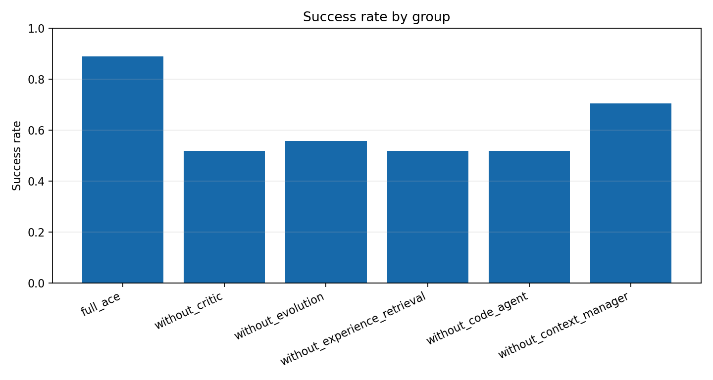

# ACE 模块消融实验 实验报告

Run ID：exp3_20260514_130634

生成时间：2026-05-14T14:45:43

配置：`{"use_critic": true, "use_evolution": true, "use_experience_retrieval": true, "use_code_agent": true, "use_context_manager": true, "use_real_ace": false, "mock_mode": true}`

## 实验设计思路

实验三围绕 ACE 的关键模块做消融，对比完整 ACE 与去掉 Critic、Evolution、经验检索、CodeAgent、ContextManager 后的性能变化。

任务展开规模：27 个任务单元；本次 trace 数：162；成功 100，失败 62。

任务文件：`data/experiments/exp3_workbook.json`。

## 数据集说明

实验使用 `data/geodata/` 下的成都 POI 与行政区 GeoJSON 图层，任务集通过自然语言描述调用检索、查询、邻近、缓冲、叠加、空间连接、聚类、热点、统计和导出等 GIS 能力。

| 数据层 | 要素数 | 几何类型 | 字段示例 |
| --- | --- | --- | --- |
| 交通设施 | 20226 | Point | name, type, address, lng, lat, province |
| 住宿服务 | 6473 | Point | name, type, address, lng, lat, province |
| 体育 | 6753 | Point | name, type, address, lng, lat, province |
| 公司 | 42299 | Point | name, type, address, lng, lat, province |
| 医疗 | 12974 | Point | name, type, address, lng, lat, province |
| 商务住宅 | 11726 | Point | name, type, address, lng, lat, province |
| 成都行政区 | 24 | Polygon | NAME |
| 政府 | 6959 | Point | name, type, address, lng, lat, province |
| 生活服务 | 54729 | Point | name, type, address, lng, lat, province |
| 科教文化 | 10916 | Point | name, type, address, lng, lat, province |
| 购物 | 102214 | Point | name, type, address, lng, lat, province |
| 金融服务 | 7157 | Point | name, type, address, lng, lat, province |
| 风景 | 337 | Point | name, type, address, lng, lat, province |
| 餐饮 | 61101 | Point | name, type, address, lng, lat, province |

## 任务集说明

任务模板包含 `expected_tools` 和 `expected_outputs`，前者用于评估工具链选择，后者用于判断地图图层、表格结果和最小结果数量是否满足预期。

| 类别 | 任务数 |
| --- | --- |
| ace_multi_step | 3 |
| adversarial_validation | 3 |
| attribute_query | 2 |
| buffer_analysis | 2 |
| code_required | 3 |
| export_highlight | 1 |
| memory_followup | 2 |
| nearby_analysis | 3 |
| poi_search | 3 |
| temporal_query | 2 |
| validation | 3 |

## Trace 说明

每个 trace 是一次任务在某个框架或消融组下的完整记录。报告中的指标均可由 trace 字段直接复算。

| 字段 | 含义 |
| --- | --- |
| task_id | 展开后的任务编号；包含模板编号、重复轮次或 batch 信息。 |
| agent_type | 执行该 trace 的框架、消融组或经验库策略。 |
| query | 自然语言 GIS 任务文本。 |
| category | 任务类别，例如 POI 检索、邻近分析、叠加分析、热点分析等。 |
| expected_tools | 任务设计时标注的期望工具链，用于计算工具选择准确率。 |
| selected_tools | 系统实际选择或模拟选择的工具链。 |
| execution_trace | 意图识别、工具选择、执行评估等关键步骤记录。 |
| errors / error_signature | 运行中出现的错误及其归一化签名，用于重复错误统计。 |
| critic_diagnosis | CriticAgent 产生的结构化诊断，消融时可为空或弱化。 |
| retrieved_experiences | 本次任务检索到的经验条目，用于经验复用率和经验有效性分析。 |
| generated_experience | 任务后沉淀的新经验，用于观察 Evolution 是否产生可复用知识。 |
| metrics | 单条 trace 的可计算指标，如 turns、runtime、execution_success、result_correctness、repair_success。 |
| structured_response | 实验一的新结构化返回，包含 selected_tools、output_types、entities、keywords、memory/experience/code 证据。 |
| validation | 实验一按参考答案自动评分的结果，包含总分、阈值、缺失项和分项得分。 |

## 指标计算方法

| 指标 | 字段 | 计算方式 |
| --- | --- | --- |
| 任务成功率 | success_rate / task_success_rate | 成功 trace 数 / trace 总数。success=true 记为 1，否则为 0。 |
| 工具选择准确率 | tool_selection_accuracy | 对每条 trace 计算 \|expected_tools ∩ selected_tools\| / \|expected_tools\|，再对有效 trace 求平均。 |
| 执行成功率 | execution_success_rate | 无 errors 且 metrics.execution_success=true 的 trace 数 / trace 总数。 |
| 结果正确率 | result_correctness | metrics.result_correctness 的算术平均值，取值范围 0-1。 |
| 平均轮数 | average_turns | metrics.turns 的算术平均值，用于衡量交互/推理链路长度。 |
| 平均耗时 | average_runtime / average_latency | metrics.runtime 的算术平均值，单位为秒。 |
| 用户干预次数 | user_intervention_count | 所有 trace 的 metrics.user_intervention_count 求和。 |
| 错误数 | error_count | 所有 trace 的 errors 列表长度求和。 |
| 重复错误率 | repeated_error_rate | 出现重复 error_signature 的错误 trace 数 / trace 总数。 |
| 修复成功率 | repair_success_rate / self_repair_rate | repair_attempted=true 的 trace 中 repair_success=true 的比例。 |
| 经验复用率 | experience_reuse_rate | retrieved_experiences 非空的 trace 数 / trace 总数。 |
| 知识保留率 | knowledge_retention_rate | Exp4 最终快照中仍保留的早期经验数 / 早期经验总数。 |
| 冗余率 | redundancy_rate | 经验文本指纹两两 Jaccard 相似度 >= 0.72 的组合数 / 组合总数。 |
| 上下文 token 数 | context_token_count | 中文字符、英文 token 和标点的近似加权计数，用于观察上下文膨胀。 |
| 有效策略条目数量 | effective_strategy_entry_count | Exp4 每步上下文中去重后的有效策略/能力条目数。 |
| 重复条目比例 | duplicate_entry_ratio | Exp4 每步上下文中重复经验条目占比，用于观察动态速查表或经验更新策略的冗余累积。 |
| 上下文突然缩短次数 | context_sudden_shorten_count | Exp4 中高位上下文 token 数突然缩短到前一步 65% 以下的次数。 |
| 性能突然下降次数 | performance_sudden_drop_count | Exp4 中相邻 adaptation step 任务准确率下降 >=0.12 的次数。 |
| Collapse 事件数 | collapse_event_count | Exp4 中相邻 adaptation step 出现高位 token 骤降到低位，且任务准确率同步下降的次数。 |

## 结果指标

| 组别 | average_runtime | average_turns | description | error_count | execution_success_rate | experience_add_rate | experience_reuse_rate | missing_modules | name | repair_success_rate | repeated_error_rate | result_correctness | task_success_rate | tool_selection_accuracy | user_intervention_count |
| --- | --- | --- | --- | --- | --- | --- | --- | --- | --- | --- | --- | --- | --- | --- | --- |
| full_ace | 0.156 | 3.570 | 完整启用 ContextManager、Experience Retrieval、CodeAgent、Critic 与 Evolution。 | 3 | 0.889 | 0.296 | 0.370 | [] | Full ACE | 0.000 | 0.111 | 0.972 | 0.889 | 1.000 | 0 |
| without_critic | 0.156 | 3.883 | 移除 CriticAgent：不能诊断错误原因，Evolution 缺少高质量错误归因。 | 13 | 0.519 | 0.000 | 0.333 | ['critic'] | ACE w/o Critic | 0.000 | 0.407 | 0.848 | 0.519 | 1.000 | 0 |
| without_evolution | 0.156 | 3.883 | 移除 EvolutionAgent：可以执行和诊断，但不能把新策略沉淀到经验库。 | 12 | 0.556 | 0.000 | 0.333 | ['evolution'] | ACE w/o Evolution | 0.000 | 0.407 | 0.875 | 0.556 | 1.000 | 0 |
| without_experience_retrieval | 0.156 | 3.994 | 移除经验检索：无法复用 CRS、空结果恢复、动态缓冲等已有经验。 | 13 | 0.519 | 0.296 | 0.000 | ['experience_retrieval'] | ACE w/o Experience Retrieval | 0.000 | 0.481 | 0.839 | 0.519 | 1.000 | 0 |
| without_code_agent | 0.138 | 3.920 | 移除 CodeAgent：无法执行 GeoPandas 代码和精确数值校验。 | 13 | 0.519 | 0.296 | 0.370 | ['code_agent'] | ACE w/o CodeAgent | 0.000 | 0.444 | 0.775 | 0.519 | 0.593 | 0 |
| without_context_manager | 0.149 | 3.920 | 移除 ContextManager：无法读取跨轮锚点、偏好和上下文引用。 | 8 | 0.704 | 0.296 | 0.370 | ['context_manager'] | ACE w/o ContextManager | 0.000 | 0.259 | 0.890 | 0.704 | 0.889 | 0 |

## 可视化图表

图表由当前 result.json 直接生成，便于论文或答辩材料引用。

## 总结分析

实验三中完整 ACE 成功率为 0；各消融组与 full_ace 的差距可用于分析 Critic、Evolution、经验检索、CodeAgent 和 ContextManager 的贡献。

基于ACE模块消融实验（exp3）结果，主要发现如下：

完整ACE系统（Full ACE）在任务成功率（0.889）、结果正确性（0.972）和工具选择准确率（1.0）上均显著优于所有消融变体。移除Critic、Evolution或Experience Retrieval任一模块，任务成功率均骤降至约0.519，结果正确性降至0.84-0.88，且重复错误率从0.111飙升至0.407-0.481。移除CodeAgent导致工具选择准确率降至0.593，结果正确性最低（0.775）。移除ContextManager影响相对较小（成功率0.704），但仍低于完整系统。

可能原因：Critic与Evolution形成闭环——Critic提供错误归因，Evolution据此沉淀经验，二者缺失导致经验无法积累（经验添加率为0），系统无法从错误中学习，重复错误激增。Experience Retrieval缺失使系统无法复用已有策略，同样导致高重复错误率。CodeAgent是执行精确数值校验的关键，其缺失严重削弱了工具选择能力。

论文中可强调的结论：ACE各模块协同构成“诊断-进化-复用”闭环，Critic与Evolution是提升任务成功率的核心组件，CodeAgent保障了工具选择的准确性。
