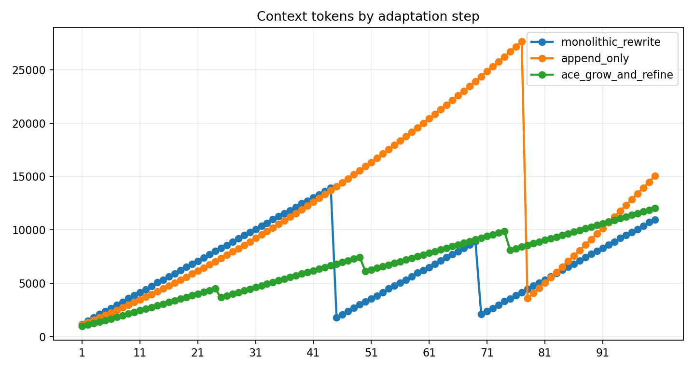
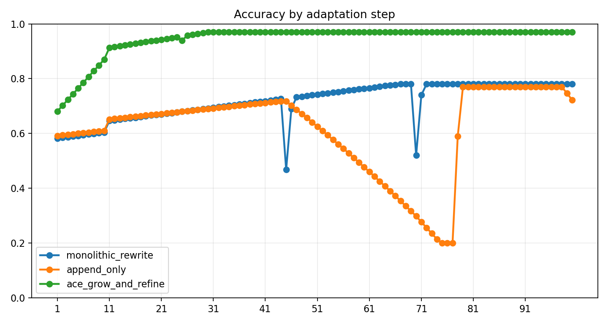

# Context Collapse 稳定性实验 实验报告

Run ID：exp4_20260514_135217

生成时间：2026-05-14T13:52:20

配置：`{"use_critic": true, "use_evolution": true, "use_experience_retrieval": true, "use_code_agent": true, "use_context_manager": true, "use_real_ace": false, "mock_mode": true}`

## 实验设计思路

实验四采用 100 个任务顺序输入的连续在线学习过程，比较周期性重写、只追加和 ACE 增长-精炼三种上下文更新策略，重点观察 context token 曲线和准确率曲线是否出现同步坍塌。

任务展开规模：100 个任务单元；本次 trace 数：300；成功 176，失败 124。

任务文件：`data/experiments/exp4_workbook.json`。

## 数据集说明

实验使用 `data/geodata/` 下的成都 POI 与行政区 GeoJSON 图层，任务集通过自然语言描述调用检索、查询、邻近、缓冲、叠加、空间连接、聚类、热点、统计和导出等 GIS 能力。

| 数据层 | 要素数 | 几何类型 | 字段示例 |
| --- | --- | --- | --- |
| 交通设施 | 20226 | Point | name, type, address, lng, lat, province |
| 住宿服务 | 6473 | Point | name, type, address, lng, lat, province |
| 体育 | 6753 | Point | name, type, address, lng, lat, province |
| 公司 | 42299 | Point | name, type, address, lng, lat, province |
| 医疗 | 12974 | Point | name, type, address, lng, lat, province |
| 商务住宅 | 11726 | Point | name, type, address, lng, lat, province |
| 成都行政区 | 24 | Polygon | NAME |
| 政府 | 6959 | Point | name, type, address, lng, lat, province |
| 生活服务 | 54729 | Point | name, type, address, lng, lat, province |
| 科教文化 | 10916 | Point | name, type, address, lng, lat, province |
| 购物 | 102214 | Point | name, type, address, lng, lat, province |
| 金融服务 | 7157 | Point | name, type, address, lng, lat, province |
| 风景 | 337 | Point | name, type, address, lng, lat, province |
| 餐饮 | 61101 | Point | name, type, address, lng, lat, province |

## 任务集说明

实验四任务集拆成 `exp4_workbook.json` 习题册和 `exp4_evaluation_config.json` 评测配置。习题册定义 10 类通用能力任务模板并展开为 100 个 adaptation step，不局限于 GIS 任务；参考答案文件记录 collapse 判定阈值：高位 token 骤降到 35% 以下且任务准确率下降至少 0.12。

| 类别 | 任务数 |
| --- | --- |
| code_reasoning | 10 |
| evaluation | 10 |
| output_control | 10 |
| planning | 10 |
| quantitative_reasoning | 10 |
| retrieval_reasoning | 20 |
| structured_reasoning | 10 |
| temporal_reasoning | 10 |
| visualization | 10 |

## Trace 说明

每个 trace 是一次任务在某个框架或消融组下的完整记录。报告中的指标均可由 trace 字段直接复算。

| 字段 | 含义 |
| --- | --- |
| task_id | 展开后的任务编号；包含模板编号、重复轮次或 batch 信息。 |
| agent_type | 执行该 trace 的框架、消融组或经验库策略。 |
| query | 自然语言 GIS 任务文本。 |
| category | 任务类别，例如 POI 检索、邻近分析、叠加分析、热点分析等。 |
| expected_tools | 任务设计时标注的期望工具链，用于计算工具选择准确率。 |
| selected_tools | 系统实际选择或模拟选择的工具链。 |
| execution_trace | 意图识别、工具选择、执行评估等关键步骤记录。 |
| errors / error_signature | 运行中出现的错误及其归一化签名，用于重复错误统计。 |
| critic_diagnosis | CriticAgent 产生的结构化诊断，消融时可为空或弱化。 |
| retrieved_experiences | 本次任务检索到的经验条目，用于经验复用率和经验有效性分析。 |
| generated_experience | 任务后沉淀的新经验，用于观察 Evolution 是否产生可复用知识。 |
| metrics | 单条 trace 的可计算指标，如 turns、runtime、execution_success、result_correctness、repair_success。 |
| structured_response | 实验一的新结构化返回，包含 selected_tools、output_types、entities、keywords、memory/experience/code 证据。 |
| validation | 实验一按参考答案自动评分的结果，包含总分、阈值、缺失项和分项得分。 |

## 指标计算方法

| 指标 | 字段 | 计算方式 |
| --- | --- | --- |
| 任务成功率 | success_rate / task_success_rate | 成功 trace 数 / trace 总数。success=true 记为 1，否则为 0。 |
| 工具选择准确率 | tool_selection_accuracy | 对每条 trace 计算 \|expected_tools ∩ selected_tools\| / \|expected_tools\|，再对有效 trace 求平均。 |
| 执行成功率 | execution_success_rate | 无 errors 且 metrics.execution_success=true 的 trace 数 / trace 总数。 |
| 结果正确率 | result_correctness | metrics.result_correctness 的算术平均值，取值范围 0-1。 |
| 平均轮数 | average_turns | metrics.turns 的算术平均值，用于衡量交互/推理链路长度。 |
| 平均耗时 | average_runtime / average_latency | metrics.runtime 的算术平均值，单位为秒。 |
| 用户干预次数 | user_intervention_count | 所有 trace 的 metrics.user_intervention_count 求和。 |
| 错误数 | error_count | 所有 trace 的 errors 列表长度求和。 |
| 重复错误率 | repeated_error_rate | 出现重复 error_signature 的错误 trace 数 / trace 总数。 |
| 修复成功率 | repair_success_rate / self_repair_rate | repair_attempted=true 的 trace 中 repair_success=true 的比例。 |
| 经验复用率 | experience_reuse_rate | retrieved_experiences 非空的 trace 数 / trace 总数。 |
| 知识保留率 | knowledge_retention_rate | Exp4 最终快照中仍保留的早期经验数 / 早期经验总数。 |
| 冗余率 | redundancy_rate | 经验文本指纹两两 Jaccard 相似度 >= 0.72 的组合数 / 组合总数。 |
| 上下文 token 数 | context_token_count | 中文字符、英文 token 和标点的近似加权计数，用于观察上下文膨胀。 |
| 有效策略条目数量 | effective_strategy_entry_count | Exp4 每步上下文中去重后的有效策略/能力条目数。 |
| 重复条目比例 | duplicate_entry_ratio | Exp4 每步上下文中重复经验条目占比，用于观察只追加策略的冗余累积。 |
| 上下文突然缩短次数 | context_sudden_shorten_count | Exp4 中高位上下文 token 数突然缩短到前一步 65% 以下的次数。 |
| 性能突然下降次数 | performance_sudden_drop_count | Exp4 中相邻 adaptation step 任务准确率下降 >=0.12 的次数。 |
| Collapse 事件数 | collapse_event_count | Exp4 中相邻 adaptation step 出现高位 token 骤降到低位，且任务准确率同步下降的次数。 |

## 结果指标

| 组别 | average_runtime | average_turns | collapse_event_count | context_sudden_shorten_count | description | error_count | execution_success_rate | experience_add_rate | experience_reuse_rate | final_context_token_count | final_duplicate_entry_ratio | final_effective_strategy_entry_count | final_redundancy_rate | final_task_accuracy | knowledge_retention_rate | max_context_token_count | name | performance_sudden_drop_count | repeated_error_rate | result_correctness | task_success_rate | tool_selection_accuracy |
| --- | --- | --- | --- | --- | --- | --- | --- | --- | --- | --- | --- | --- | --- | --- | --- | --- | --- | --- | --- | --- | --- | --- |
| monolithic_rewrite | 0.120 | 3.545 | 2 | 2 | 周期性把长上下文压缩为很短摘要，容易在压缩点丢失早期技能并触发 context collapse。 | 44 | 0.560 | 1.000 | 0.880 | 10980 | 0.763 | 10 | 0.763 | 0.780 | 1.000 | 13960 | Periodic Rewrite Baseline | 2 | 0.440 | 0.717 | 0.560 | 1.000 |
| append_only | 0.120 | 3.342 | 0 | 1 | 只追加任务记录和经验，不做结构化精炼；上下文持续膨胀，到达预算后被动截断。 | 78 | 0.220 | 1.000 | 0.900 | 15053 | 0.920 | 10 | 0.920 | 0.722 | 1.000 | 27652 | Append-only Baseline | 0 | 0.780 | 0.617 | 0.220 | 1.000 |
| ace_grow_and_refine | 0.120 | 2.848 | 0 | 0 | ACE 将任务反馈沉淀为结构化经验，并阶段性合并、去冗余和保留核心技能，使上下文平稳增长或温和精简。 | 2 | 0.980 | 1.000 | 0.900 | 12028 | 0.000 | 10 | 0.000 | 0.970 | 1.000 | 12028 | ACE Grow-and-Refine | 0 | 0.000 | 0.945 | 0.980 | 1.000 |

## 可视化图表

图表由当前 result.json 直接生成，便于论文或答辩材料引用。

## 总结分析

实验四中 ACE grow-and-refine 最终任务准确率为 0.970，最终上下文 token 数为 12028，collapse 事件数为 0；可用于说明 ACE 在连续在线学习中能避免上下文坍塌。

未启用 DeepSeek 自动总结；可在导出时勾选 AI 总结生成更自然的论文式分析。
