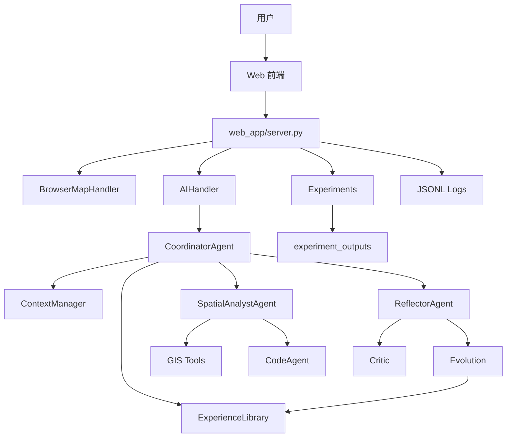

# GeoAI ACE WebGIS 项目分析报告

## 1. 项目概述

GeoAI ACE WebGIS 是一个基于 ACE（Agentic Context Engineering）机制的多 Agent 地理空间分析原型系统。项目位于 `d:/geoai`，目标不是做普通聊天问答，而是构建一个能执行 GIS 任务、能反思错误、能沉淀经验、能在后续任务中复用经验的 WebGIS 系统。

系统面向成都本地 POI 与行政区数据，支持用户用自然语言提出空间分析任务，并通过多 Agent 协同完成图层选择、工具调用、空间代码执行、结果解释和地图高亮。

## 2. 当前能力

- 统一入口首页：`/`
- 地理智能系统：`/gis`
- 对比实验系统：`/experiment`
- MapLibre WebGIS 地图
- GeoJSON 图层按视野加载
- POI 搜索、属性查询、详情查看
- 邻近、缓冲区、叠加、空间连接、最近邻、聚类、热点、统计和导出
- 受控 GeoPandas 空间代码执行
- 多 Agent 调度
- ACE 经验库检索、诊断、演化和复用
- 多会话管理
- 多经验库管理
- JSONL 运行日志
- 四组实验系统
- 论文证据汇总接口

## 3. 系统架构

## 4. Agent 分工

| Agent | 文件 | 职责 |
|---|---|---|
| `CoordinatorAgent` | `agents/coordinator_agent.py` | 任务分类、上下文组织、经验检索、调度 |
| `SpatialAnalystAgent` | `agents/spatial_analyst_agent.py` | 选择和调用 GIS 工具 |
| `CodeAgent` | `agents/code_agent.py` | 生成、执行和修复空间分析代码 |
| `ReflectorAgent` | `agents/reflector_agent.py` | 连接错误诊断、用户反馈和经验演化 |

## 5. ACE 闭环

ACE 在本项目中体现为：

1. 任务前检索经验，避免重复犯错。
2. 任务中记录工具调用和代码执行轨迹。
3. 任务后对错误、空结果或用户纠正进行结构化诊断。
4. 将诊断转成经验条目。
5. 后续任务重新检索并注入高置信经验。

这让系统从“一次性回答”转向“持续学习式执行”。

## 6. GIS 工具集

当前工具层覆盖三类能力：

基础查询：

- `search_poi`
- `query_poi_by_conditions`
- `get_poi_by_index`

空间分析：

- `find_nearby`
- `find_nearby_point`
- `find_nearby_point_filtered`
- `buffer_analysis`
- `overlay_layers`
- `spatial_join`
- `nearest_neighbor`
- `dbscan`
- `hotspot`
- `statistics`

高级能力：

- `export`
- `execute_spatial_code`

## 7. 数据与接口

默认数据：

- `data/geodata/餐饮.geojson`
- `data/geodata/住宿服务.geojson`
- `data/geodata/成都行政区.geojson`

原始 Shapefile：

- `geodata/餐饮_61102.*`
- `geodata/住宿服务_6474.*`
- `geodata/成都行政区__加高新天府东区.*`

关键 API：

- `/api/layers`
- `/api/layer_data`
- `/api/chat`
- `/api/highlights`
- `/api/trace`
- `/api/ace-panel`
- `/api/experience`
- `/api/sessions`
- `/api/experience-banks`
- `/api/experiment/expX/*`
- `/api/thesis/evidence`

## 8. 实验系统分析

项目已经具备四组实验：

| 实验 | 作用 |
|---|---|
| exp1 | 验证 ACE 相对 Base LLM 的整体提升 |
| exp2 | 验证 Critic、Evolution、经验库、上下文记忆等模块贡献 |
| exp3 | 验证多轮任务中的记忆抗退化 |
| exp4 | 验证长上下文压缩与污染控制 |

`experiments/export_utils.py` 支持导出论文图表，`experiments/thesis_evidence.py` 支持汇总论文证据。

## 9. 主要优势

- 任务执行链条清晰，便于论文解释。
- GIS 工具覆盖较完整，能支撑多类空间任务。
- ACE 闭环具备可观测日志和经验库文件。
- 前端已分离为首页、GIS 页面和实验页面。
- 实验系统与论文证据接口已经成型。

## 10. 当前风险

- 代码中部分中文字符串存在编码错乱，可能影响 UI 文案、反馈识别和论文展示。
- 实验结果需要持续核验，避免把模拟指标与真实运行指标混用。
- 经验库需要增加冲突检测和审核机制。
- 标准基准数据集接入仍不足，目前主要依赖本地成都数据。
- 对遥感影像、栅格数据和轨迹数据支持不足。

## 11. 建议优先级

1. 修复代码和数据中的中文编码问题。
2. 用真实任务重新跑四组实验，并固定实验输出目录。
3. 将 `/api/thesis/evidence` 的结果整理进论文图表和表格。
4. 增加经验库冲突检测、版本记录和回滚机制。
5. 扩充数据集和任务类型，提高论文实验说服力。
