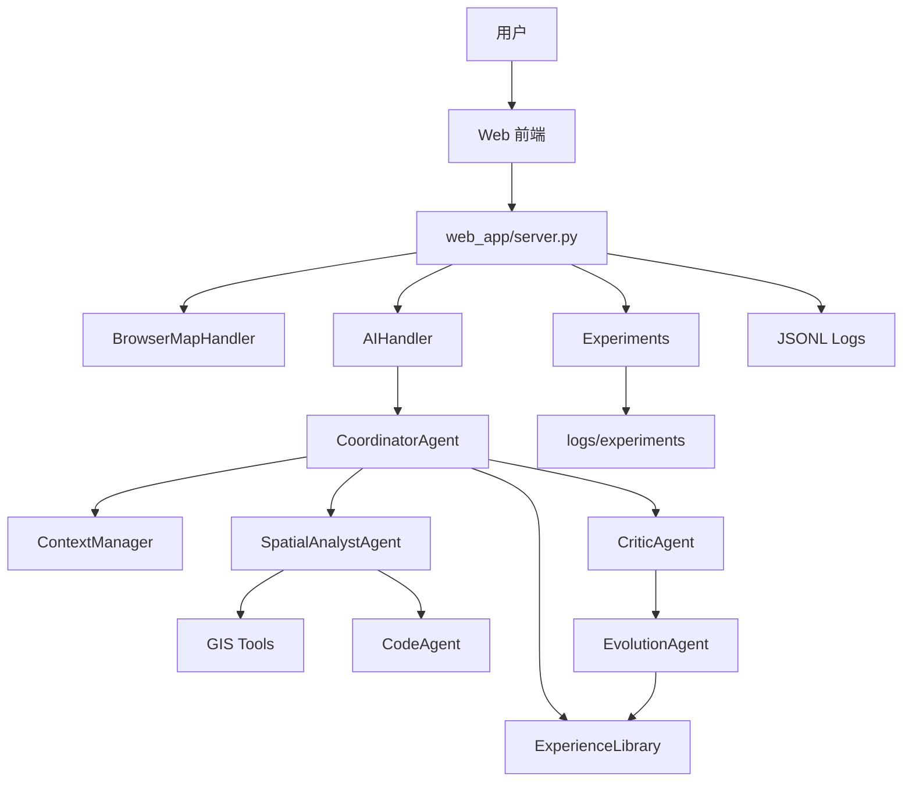

# GeoAI ACE WebGIS 项目分析报告

## 1. 项目概述

GeoAI ACE WebGIS 是一个基于 ACE（Agentic Context Engineering）机制的多 Agent 地理空间分析原型系统。项目位于 `d:/geoai`，目标不是做普通聊天问答，而是构建一个能执行 GIS 任务、能反思错误、能沉淀经验、能在后续任务中复用经验的 WebGIS 系统。

系统面向成都本地 POI 与行政区数据，支持用户用自然语言提出空间分析任务，并通过多 Agent 协同完成图层选择、工具调用、空间代码执行、结果解释和地图高亮。

## 2. 当前能力

- 统一入口首页：`/`
- 地理智能系统：`/gis`
- 对比实验系统：`/experiment`
- MapLibre WebGIS 地图
- GeoJSON 图层按视野加载
- POI 搜索、属性查询、详情查看
- 邻近、缓冲区、叠加、空间连接、最近邻、聚类、热点、统计和导出
- 受控 GeoPandas 空间代码执行
- 多 Agent 调度
- ACE 经验库检索、诊断、演化和复用
- 多会话管理
- 多经验库管理
- JSONL 运行日志
- 四组实验系统
- 论文证据汇总接口

## 3. 系统架构

## 4. Agent 分工

| Agent | 文件 | 职责 |
|---|---|---|
| `CoordinatorAgent` | `agents/coordinator_agent.py` | 任务分类、上下文组织、经验检索、调度 |
| `SpatialAnalystAgent` | `agents/spatial_analyst_agent.py` | 选择和调用 GIS 工具 |
| `CodeAgent` | `agents/code_agent.py` | 生成、执行和修复空间分析代码 |
| `CriticAgent` | `agents/critic_agent.py` | 对工具错误、空结果、代码异常和用户纠正进行结构化诊断 |
| `EvolutionAgent` | `agents/evolution_agent.py` | 将诊断结果和用户反馈沉淀为可复用经验 |

## 5. ACE 闭环

ACE 在本项目中体现为：

1. 任务前检索经验，避免重复犯错。
2. 任务中记录工具调用和代码执行轨迹。
3. 任务后对错误、空结果或用户纠正进行结构化诊断。
4. 将诊断转成经验条目。
5. 后续任务重新检索并注入高置信经验。

这让系统从“一次性回答”转向“持续学习式执行”。

## 6. GIS 工具集

当前工具层覆盖三类能力，共 15 个注册工具，由 [`tools/__init__.py`](tools/__init__.py) 统一注册：

| 工具 | 实现文件 | 能力分类 |
|---|---|---|
| `search_poi` | [`tools/search.py`](tools/search.py) | 基础查询 |
| `query_poi_by_conditions` | [`tools/query.py`](tools/query.py) | 基础查询 |
| `get_poi_by_index` | [`tools/detail.py`](tools/detail.py) | 基础查询 |
| `find_nearby` | [`tools/nearby.py`](tools/nearby.py) | 空间分析 |
| `find_nearby_point` | [`tools/nearby.py`](tools/nearby.py) | 空间分析 |
| `find_nearby_point_filtered` | [`tools/nearby.py`](tools/nearby.py) | 空间分析 |
| `buffer_analysis` | [`tools/buffer_tool.py`](tools/buffer_tool.py) | 空间分析 |
| `overlay_layers` | [`tools/overlay_tool.py`](tools/overlay_tool.py) | 空间分析 |
| `spatial_join` | [`tools/overlay_tool.py`](tools/overlay_tool.py) | 空间分析 |
| `nearest_neighbor` | [`tools/proximity_tool.py`](tools/proximity_tool.py) | 空间分析 |
| `dbscan` | [`tools/clustering_tool.py`](tools/clustering_tool.py) | 空间分析 |
| `hotspot` | [`tools/clustering_tool.py`](tools/clustering_tool.py) | 空间分析 |
| `statistics` | [`tools/statistics_tool.py`](tools/statistics_tool.py) | 空间分析 |
| `export` | [`tools/export_tool.py`](tools/export_tool.py) | 高级能力 |
| `execute_spatial_code` | [`tools/code_executor.py`](tools/code_executor.py) | 高级能力 |

辅助模块：

| 文件 | 作用 |
|---|---|
| [`tools/advanced_common.py`](tools/advanced_common.py) | 高级空间分析通用工具函数 |
| [`tools/utils_geo.py`](tools/utils_geo.py) | 地理空间工具函数集 |

## 7. 数据与接口

默认数据：

| 数据 | 文件 | 类型 | 用途 |
|---|---|---|---|
| 餐饮 POI | [`data/geodata/餐饮.geojson`](data/geodata/餐饮.geojson) | 点 | POI 检索、统计、聚类 |
| 住宿服务 POI | [`data/geodata/住宿服务.geojson`](data/geodata/住宿服务.geojson) | 点 | 查询和邻近分析 |
| 成都行政区 | [`data/geodata/成都行政区.geojson`](data/geodata/成都行政区.geojson) | 面 | 行政区统计和地图高亮 |
| 风景 POI | [`data/geodata/风景.geojson`](data/geodata/风景.geojson) | 点 | POI 检索 |
| 交通设施 POI | [`data/geodata/交通设施.geojson`](data/geodata/交通设施.geojson) | 点 | POI 检索 |
| 购物 POI | [`data/geodata/购物.geojson`](data/geodata/购物.geojson) | 点 | POI 检索 |
| 公司 POI | [`data/geodata/公司.geojson`](data/geodata/公司.geojson) | 点 | POI 检索 |
| 科教文化 POI | [`data/geodata/科教文化.geojson`](data/geodata/科教文化.geojson) | 点 | POI 检索 |
| 金融服务 POI | [`data/geodata/金融服务.geojson`](data/geodata/金融服务.geojson) | 点 | POI 检索 |
| 商务住宅 POI | [`data/geodata/商务住宅.geojson`](data/geodata/商务住宅.geojson) | 点 | POI 检索 |
| 生活服务 POI | [`data/geodata/生活服务.geojson`](data/geodata/生活服务.geojson) | 点 | POI 检索 |
| 体育 POI | [`data/geodata/体育.geojson`](data/geodata/体育.geojson) | 点 | POI 检索 |
| 医疗 POI | [`data/geodata/医疗.geojson`](data/geodata/医疗.geojson) | 点 | POI 检索 |
| 政府 POI | [`data/geodata/政府.geojson`](data/geodata/政府.geojson) | 点 | POI 检索 |

数据存储目录：

- [`data/geodata/`](data/geodata/)：GeoJSON 空间数据
- [`data/experience_libraries/`](data/experience_libraries/)：用户创建的经验库
- [`data/exports/`](data/exports/)：导出文件
- [`data/ace_experience_library.json`](data/ace_experience_library.json)：默认经验库
- [`data/experience_banks.json`](data/experience_banks.json)：经验库索引
- [`data/sessions.json`](data/sessions.json)：会话数据

关键 API：

- `GET /api/layers`：图层元信息
- `GET /api/layer_data`：按视野加载 GeoJSON
- `POST /api/chat`：发送自然语言任务
- `GET /api/highlights`：地图高亮
- `GET /api/trace`：任务 Trace
- `GET /api/ace-panel`：ACE 面板
- `GET /api/experience`：经验库内容
- `GET /api/sessions`：会话管理
- `GET /api/experience-banks`：经验库管理
- `GET/POST /api/experiment/expX/*`：实验系统
- `GET /api/thesis/evidence`：论文证据汇总

## 8. 实验系统分析

项目已经具备四组实验：

| 实验 | 作用 |
|---|---|
| exp1 | GeoAI 主系统能力评测，对比 Base/RAG/ACE 在空间任务上的整体差异 |
| exp2 | Online Adaptation 在线适应实验，验证静态经验、新经验写入和最终迁移效果 |
| exp3 | ACE 机制消融实验，比较单模块移除、无 Reflector、append-only 和整体重写 |
| exp4 | GeoAI Context Collapse 稳定性实验，验证连续在线适应中的上下文坍塌与精炼稳定性 |

`experiments/export_utils.py` 支持导出论文图表，`experiments/thesis_evidence.py` 支持汇总论文证据。

## 9. 主要优势

- 任务执行链条清晰，便于论文解释。
- GIS 工具覆盖较完整，能支撑多类空间任务。
- ACE 闭环具备可观测日志和经验库文件。
- 前端已分离为首页、GIS 页面和实验页面。
- 实验系统与论文证据接口已经成型。

## 10. 当前风险

- 代码中部分中文字符串存在编码错乱，可能影响 UI 文案、反馈识别和论文展示。
- 实验结果需要持续核验，避免把模拟指标与真实运行指标混用。
- 经验库需要增加冲突检测和审核机制。
- 标准基准数据集接入仍不足，目前主要依赖本地成都数据。
- 对遥感影像、栅格数据和轨迹数据支持不足。

## 11. 建议优先级

1. 修复代码和数据中的中文编码问题。
2. 用真实任务重新跑四组实验，并固定实验输出目录。
3. 将 `/api/thesis/evidence` 的结果整理进论文图表和表格。
4. 增加经验库冲突检测、版本记录和回滚机制。
5. 扩充数据集和任务类型，提高论文实验说服力。
