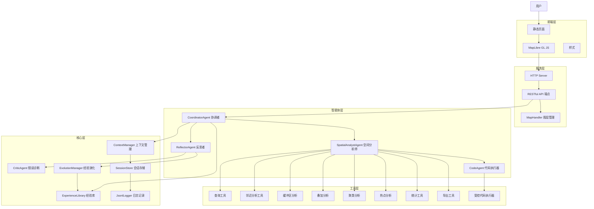
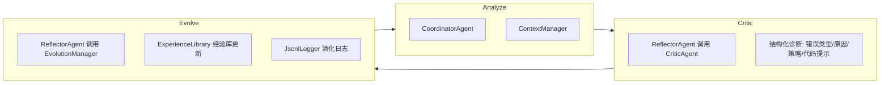

# GeoAI ACE WebGIS 项目分析报告

## 1. 项目概览

**GeoAI ACE WebGIS** 是一个基于 **ACE（Agentic Context Engineering）** 机制的多智能体 WebGIS 原型系统，位于 [`d:/geoai`](d:/geoai)。它允许用户通过自然语言提出地理空间分析任务，并通过多智能体协作系统自动调度 GIS 工具、生成分析代码、执行空间运算、可视化结果，并具备自我进化的经验库。

### 核心目标
> 不是单纯的"聊天问答"，而是构建一个**可执行、可反思、可演化**的 GeoAI 原型。

---

## 2. 系统架构（四层结构）



---

## 3. 智能体系统详解

### 3.1 [`CoordinatorAgent`](agents/coordinator_agent.py) - 协调者智能体

- **职责**：意图识别、任务规划、上下文组织、多轮调度
- **输入**：用户自然语言输入
- **工作流程**：
  1. 通过 [`ContextManager.classify_intent()`](core/context_manager.py:19) 识别任务类型（help/nearby/query/search/mapping/overlay/general）
  2. 调用 [`ExperienceLibrary.retrieve()`](core/experience_library.py:98) 检索相关经验
  3. 构建系统提示词（包含任务类型、计划、经验、会话上下文、图层模式、工具列表）
  4. 判断是否直接回答（帮助型问题）或进入调度循环
  5. 调度循环（最多 6 轮）：调用 `SpatialAnalystAgent.think()` → 检查工具调用 → 执行工具 → `ReflectorAgent.evaluate()` → 累积上下文

### 3.2 [`SpatialAnalystAgent`](agents/spatial_analyst_agent.py) - 空间分析师智能体

- **职责**：调用 GIS 工具或触发代码执行
- **核心逻辑**：通过 LangChain `bind_tools` 将 15 个工具绑定到 LLM，让 LLM 决定调用哪个工具

### 3.3 [`CodeAgent`](agents/code_agent.py) - 代码执行智能体

- **职责**：生成并执行受控 GeoPandas/Pandas 空间分析代码
- **重试机制**：最多 2 次重试，每次失败后通过 LLM 修复代码
- **安全限制**：沙箱环境，禁止 import/文件操作/系统命令

### 3.4 [`ReflectorAgent`](agents/reflector_agent.py) - 反思者智能体

- **职责**：评估工具反馈，闭环 ACE 自进化
- **内部组件**：
  - [`CriticAgent`](core/critic.py) - 结构化错误诊断（6 种错误模式）
  - [`EvolutionManager`](core/evolution.py) - 经验抽取、去重、质量更新

---

## 4. ACE 自进化闭环



### 错误诊断模式（[`critic.py`](core/critic.py:4)）：

| 错误类型 | 触发条件 | 策略 |
|---------|---------|------|
| CRS_ERROR | CRS/投影相关关键词 | 统一投影到米制 CRS |
| DISTANCE_UNIT_ERROR | 距离单位混淆 | 内部统一换算为米 |
| FIELD_ERROR | 字段名不存在 | 读取真实 schema 后重建条件 |
| EMPTY_RESULT | 结果为空 | 放宽搜索范围逐步收窄 |
| GEOMETRY_ERROR | 无效几何 | 跳过空要素，规范化几何 |
| TIMEOUT_OR_LOOP | 超时/循环 | 缩小范围，限制结果规模 |

### 经验质量控制（[`experience_library.py`](core/experience_library.py:8)）：
- 置信度 `confidence` 阈值：0.35（低于此值不注入 prompt）
- 去重机制：`SequenceMatcher` 相似度 ≥ 0.72 视为重复
- 质量更新：`success_count / fail_count` 动态调整置信度
- 用户反馈特殊处理：源为 `user_feedback` 且类别为 "用户纠正" 时保底置信度 0.5

---

## 5. GIS 工具集

### 基础查询工具
| 工具 | 功能 | 文件 |
|------|------|------|
| `search_poi` | 跨图层全文搜索 | [`tools/search.py`](tools/search.py) |
| `query_poi_by_conditions` | 按属性条件筛选 | [`tools/query.py`](tools/query.py) |
| `get_poi_by_index` | 按索引获取 POI 详情 | [`tools/detail.py`](tools/detail.py) |

### 邻近分析工具
| 工具 | 功能 | 文件 |
|------|------|------|
| `find_nearby` | 图层间邻近查询 | [`tools/nearby.py`](tools/nearby.py) |
| `find_nearby_point` | 以单要素为中心邻近分析 | [`tools/nearby.py`](tools/nearby.py) |
| `find_nearby_point_filtered` | 带关键词过滤的邻近分析 | [`tools/nearby.py`](tools/nearby.py) |
| `nearest_neighbor_search` | 最近邻分析 | [`tools/proximity_tool.py`](tools/proximity_tool.py) |

### 高级空间分析工具
| 工具 | 功能 | 文件 |
|------|------|------|
| `buffer_analysis` | 缓冲区分析 | [`tools/buffer_tool.py`](tools/buffer_tool.py) |
| `overlay_layers` | 空间叠加 | [`tools/overlay_tool.py`](tools/overlay_tool.py) |
| `spatial_join_layers` | 空间连接 | [`tools/overlay_tool.py`](tools/overlay_tool.py) |
| `cluster_points_dbscan` | DBSCAN 聚类 | [`tools/clustering_tool.py`](tools/clustering_tool.py) |
| `hotspot_analysis` | 网格热点分析 | [`tools/clustering_tool.py`](tools/clustering_tool.py) |
| `summarize_layer_statistics` | 统计汇总 | [`tools/statistics_tool.py`](tools/statistics_tool.py) |
| `export_analysis_result` | 结果导出 | [`tools/export_tool.py`](tools/export_tool.py) |

### 代码执行
| 工具 | 功能 | 文件 |
|------|------|------|
| `execute_spatial_code` | 受控空间代码执行 | [`tools/code_executor.py`](tools/code_executor.py) |

---

## 6. 数据流与 API

### 启动流程
1. [`main_web.py`](main_web.py) → [`web_app/server.py:run()`](web_app/server.py:239)
2. `WebGISAppState` 初始化：
   - [`BrowserMapHandler`](web_app/web_map_handler.py:11) 从 `data/geodata/*.geojson` 读取图层元信息
   - [`AIHandler`](ai_handler.py:14) 初始化 LLM、ContextManager、ExperienceLibrary、各 Agent、GIS Tools

### 核心 API 端点

#### 图层相关
- `GET /api/layers` - 返回图层元信息（名称、字段、几何类型、要素数、bbox、CRS）
- `GET /api/layer_data?layer_name=...&bbox=...&zoom=...` - 按视野加载 GeoJSON
- `GET /api/highlights` - 返回当前高亮要素
- `POST /api/highlights/clear` - 清空高亮

#### 问答与分析
- `POST /api/chat` - 发送用户消息，返回 `answer/trace/ace_panel/experience/session/highlights`
- `GET /api/trace` - 获取最新 Trace
- `GET /api/ace-panel` - 获取 ACE 面板

#### 会话管理
- `GET /api/sessions` / `POST /api/sessions/new` / `POST /api/sessions/switch` / `POST /api/sessions/rename` / `POST /api/sessions/delete`

#### 经验库管理
- `GET /api/experience` / `GET /api/experience-banks` / `POST /api/experience-banks/switch` / `POST /api/experience-banks/create` / `POST /api/experience-banks/rename` / `POST /api/experience-banks/delete`

### 前端图层加载策略
1. 首屏只请求 `/api/layers` 获取图层元信息
2. 用户勾选图层时，请求 `/api/layer_data` 带 `bbox` 参数
3. 地图移动结束后，前端使用 debounce（450ms）自动刷新已勾选图层
4. 大图层（≥10000 要素）需放大到 12 级后再加载

---

## 7. 当前数据

位于 [`data/geodata/`](data/geodata/)：
- `成都行政区.geojson` - 成都行政区划面数据
- `餐饮.geojson` - 餐饮 POI 点数据
- `住宿服务.geojson` - 住宿 POI 点数据

同时 [`geodata/`](geodata/) 目录包含对应的 Shapefile 版本。

---

## 8. 实验系统

项目在 [`experiments/`](../experiments/) 目录下实现了 4 组对比实验，用于分维度评估 ACE 机制效果。

### 8.1 实验结构

```text
experiments/
├─ __init__.py              # 统一导出入口
├─ runner.py                # 统一运行器
├─ export_utils.py          # matplotlib 图表导出工具
├─ exp1/                    # 实验一：基线对比
├─ exp2/                    # 实验二：消融分析
├─ exp3/                    # 实验三：记忆抗退化
├─ exp4/                    # 实验四：长上下文扩展
└─ experiment_outputs/      # 运行输出（summary.json + 图片）
```

### 8.2 实验一览

| 实验 | 目录 | 评估内容 | 关键指标 |
|------|------|---------|---------|
| 实验一 | [`exp1/`](../experiments/exp1/) | Base LLM vs ACE 增强 | 任务完成率、工具成功率、代码成功率、准确率、响应时间 |
| 实验二 | [`exp2/`](../experiments/exp2/) | 模块消融（完整/无Critic/无Evolution/无经验库/无上下文） | 准确率、工具成功率、多轮一致性、模块贡献度、错误传播深度 |
| 实验三 | [`exp3/`](../experiments/exp3/) | 长周期对话记忆退化 | POI 召回率、偏好持久率、经验复用率、鲁棒性得分、记忆半衰期 |
| 实验四 | [`exp4/`](../experiments/exp4/) | 长上下文扩展（完整/截断/压缩） | 长序列准确率、跨轮引用准确率、上下文压缩率、污染率 |

### 8.3 图表导出

[`experiments/export_utils.py`](../experiments/export_utils.py) 是 matplotlib 图表导出核心模块，解决了以下问题：

| 问题 | 解决方式 |
|------|---------|
| ① 英文标签 | 自动检测中文字体（SimHei/Microsoft YaHei/DengXian），所有标题、坐标轴、图例、数值标注使用中文 |
| ② 缺失可视化 | 每个实验补全到 3–4 张图片，覆盖所有前端 Chart.js 可视化（雷达图、热力图、错误分析、污染分析、引用分析、压缩分析） |
| ③ 美观度差 | 统一调色板、柱顶/点上数值标注、网格虚线、移除冗余边框、高 DPI 160、facecolor 白色背景 |

**导出图片清单：**

| 实验 | 图片数 | 图片文件 |
|------|--------|---------|
| exp1 | 4 | `exp1_metric_comparison.png`, `exp1_response_time.png`, `exp1_radar.png`, `exp1_heatmap.png` |
| exp2 | 3 | `exp2_ablation_metrics.png`, `exp2_module_contribution.png`, `exp2_error_analysis.png` |
| exp3 | 3 | `exp3_memory_decay.png`, `exp3_system_metrics.png`, `exp3_pollution.png` |
| exp4 | 4 | `exp4_accuracy_curve.png`, `exp4_system_metrics.png`, `exp4_reference.png`, `exp4_compression.png` |

### 8.4 导出方式

```python
from experiments.export_utils import ensure_matplotlib_exports, build_export_zip

# 生成图片到 figures/ 目录
ensure_matplotlib_exports("experiments/experiment_outputs/exp1/exp1_both_20260429-132217")

# 打包为 zip（含 summary.json + results.csv + 图片 + manifest）
build_export_zip("experiments/experiment_outputs/exp1/exp1_both_20260429-132217")
```

---

## 9. 技术栈

| 组件 | 技术 |
|------|------|
| 后端语言 | Python 3.10+ |
| LLM | DeepSeek Chat（通过 `langchain-deepseek`） |
| 空间分析 | GeoPandas, Pandas, Shapely, NumPy |
| 前端地图 | MapLibre GL JS |
| 实验前端 | Chart.js（Chart.js 可视化） |
| 实验图表导出 | Matplotlib（Agg 后端，中文标签） |
| HTTP 服务 | Python 内置 `http.server`（线程化） |
| 数据格式 | GeoJSON, Shapefile |
| 日志 | JSONL（JSON Lines） |
| 配置 | `.env`（API 密钥） |

---

## 10. 关键设计特点

1. **多智能体协作**：CoordinatorAgent → SpatialAnalystAgent/CodeAgent → ReflectorAgent 形成完整闭环
2. **ACE 自进化**：错误自动诊断 → 经验自动沉淀 → 高质量经验自动注入后续 prompt
3. **受控代码执行**：沙箱环境，AST 静态分析安全检查，禁止 import/文件操作
4. **自然语言反馈**：用户可直接输入"不对，应该..."，系统自动解析为反馈并更新经验库
5. **会话级偏好记忆**：可记住用户偏好（如"只高亮行政区面图层"）并在后续轮次持续生效
6. **按需加载**：前端仅加载当前视野内的要素，支持大图层惰性加载
7. **多重经验库**：支持创建/切换/重命名/删除多个经验库，便于 A/B 实验对比
8. **完整实验系统**：4 组对比实验 + matplotlib 中文图表导出，覆盖多维度的 ACE 效果评估
